# Azure Functions Architecture for NRG Legislative Intelligence

## Table of Contents
1. [Architecture Overview](#architecture-overview)
2. [Environment Strategy](#environment-strategy)
3. [Component Details](#component-details)
4. [Data Flow](#data-flow)
5. [Security Architecture](#security-architecture)
6. [Deployment Pipeline](#deployment-pipeline)
7. [Monitoring & Observability](#monitoring--observability)
8. [Cost Optimization](#cost-optimization)

---

## Architecture Overview

### High-Level System Architecture

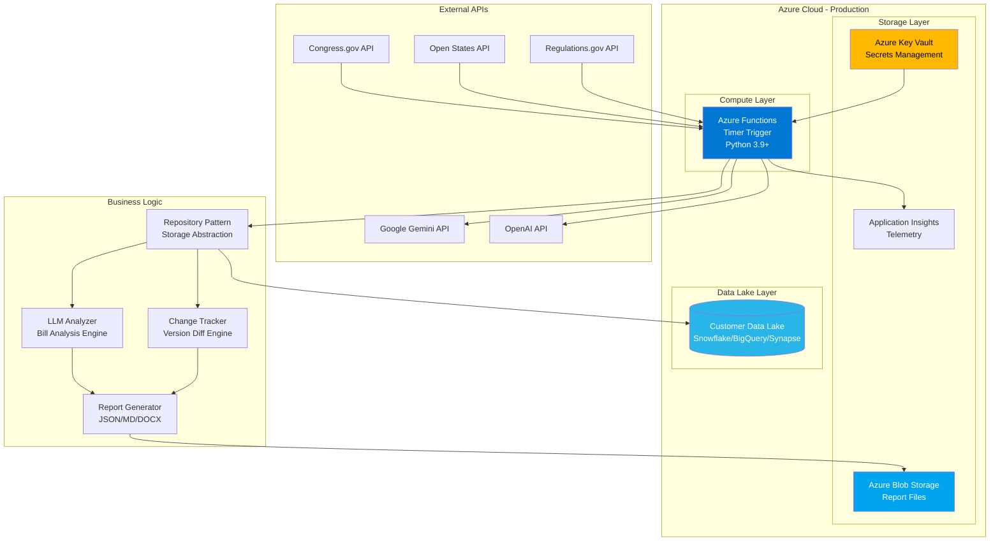

### Component Interaction Diagram

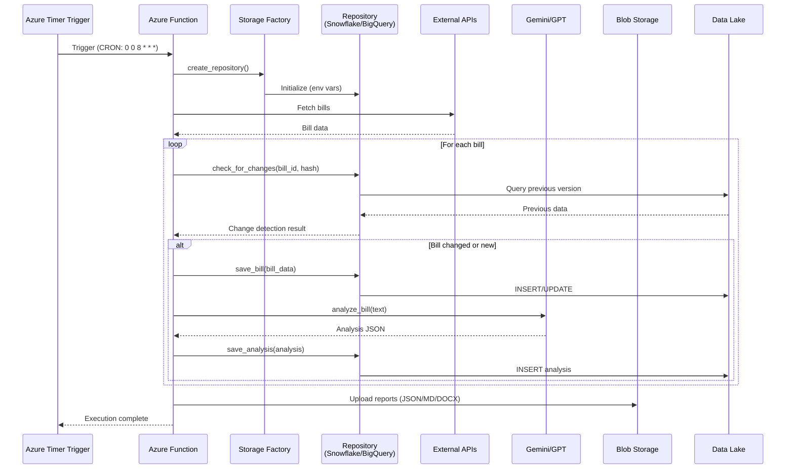

---

## Environment Strategy

### Dev vs Prod Separation

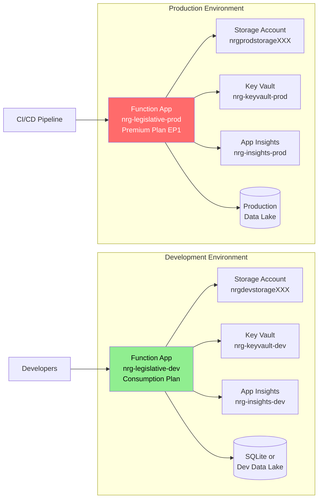

### Environment Configuration Matrix

| Component | Development | Production |
|-----------|-------------|------------|
| **Function App Plan** | Consumption (Y1) | Premium EP1 or Consumption |
| **Runtime** | Python 3.9 | Python 3.9 |
| **Region** | East US 2 | Same as customer data lake |
| **Storage Backend** | `sqlite` or dev Snowflake | Customer's production data lake |
| **API Rate Limits** | Reduced (3 bills/source) | Full (10+ bills/source) |
| **Execution Schedule** | Manual/hourly testing | Daily 8 AM UTC |
| **Always On** | No | Yes (Premium) or N/A (Consumption) |
| **VNet Integration** | No | Yes (if customer requires) |
| **Deployment Slots** | No | Yes (staging slot) |
| **Cost** | ~$10-20/month | ~$70-220/month |

---

## Component Details

### 1. Azure Function App

**Purpose:** Serverless compute execution environment

**Configuration:**
```yaml
Runtime: Python 3.9
Trigger: Timer (CRON expression)
Timeout: 10 minutes (Consumption) or 60 minutes (Premium)
Memory: 1.5 GB default
Parallelism: Single instance (no concurrent executions needed)
```

**App Settings (Environment Variables):**
```bash
# Function Configuration
FUNCTIONS_WORKER_RUNTIME=python
FUNCTIONS_EXTENSION_VERSION=~4
PYTHON_ISOLATE_WORKER_DEPENDENCIES=1

# Storage Backend Selection
STORAGE_BACKEND=snowflake  # or bigquery, synapse, sqlite

# Snowflake Configuration (if used)
SNOWFLAKE_ACCOUNT=xy12345.us-east-1
SNOWFLAKE_USER=nrg_etl_user
SNOWFLAKE_PASSWORD=@Microsoft.KeyVault(SecretUri=https://nrg-kv-prod.vault.azure.net/secrets/snowflake-pwd/)
SNOWFLAKE_WAREHOUSE=NRG_ETL_WH
SNOWFLAKE_DATABASE=NRG_DATA
SNOWFLAKE_SCHEMA=LEGISLATIVE

# API Keys (from Key Vault)
CONGRESS_API_KEY=@Microsoft.KeyVault(...)
OPENSTATES_API_KEY=@Microsoft.KeyVault(...)
GOOGLE_API_KEY=@Microsoft.KeyVault(...)
OPENAI_API_KEY=@Microsoft.KeyVault(...)

# Application Insights
APPLICATIONINSIGHTS_CONNECTION_STRING=InstrumentationKey=...

# Output Storage
AZURE_STORAGE_CONNECTION_STRING=@Microsoft.KeyVault(...)
REPORT_OUTPUT_CONTAINER=legislative-reports
```

**Scaling Configuration:**
```json
{
  "functionAppScaleLimit": 1,
  "minimumElasticInstanceCount": 0,
  "instanceMemoryMB": 2048
}
```

---

### 2. Storage Architecture with Pluggable Backends

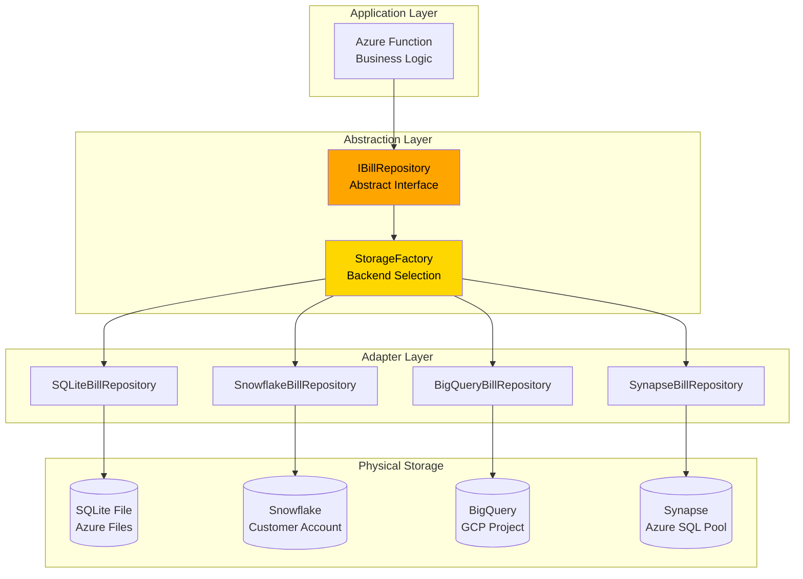

**Data Models:**

```sql
-- Bills Table (Primary bill metadata)
CREATE TABLE bills (
    bill_id VARCHAR PRIMARY KEY,
    source VARCHAR NOT NULL,
    bill_number VARCHAR,
    title TEXT,
    full_text TEXT,
    text_hash VARCHAR,
    last_updated TIMESTAMP,
    status VARCHAR,
    created_at TIMESTAMP DEFAULT CURRENT_TIMESTAMP
);

-- Bill Versions Table (Track all versions)
CREATE TABLE bill_versions (
    version_id VARCHAR PRIMARY KEY,
    bill_id VARCHAR NOT NULL,
    version_number INTEGER,
    version_type VARCHAR,
    version_date TIMESTAMP,
    full_text TEXT,
    text_hash VARCHAR,
    word_count INTEGER,
    created_at TIMESTAMP,
    FOREIGN KEY (bill_id) REFERENCES bills(bill_id)
);

-- Analyses Table (LLM analysis results)
CREATE TABLE analyses (
    analysis_id VARCHAR PRIMARY KEY,
    bill_id VARCHAR NOT NULL,
    version_id VARCHAR,
    analysis_json TEXT/VARIANT,  -- JSON type varies by platform
    impact_score INTEGER,
    analyzed_at TIMESTAMP DEFAULT CURRENT_TIMESTAMP,
    llm_provider VARCHAR,
    FOREIGN KEY (bill_id) REFERENCES bills(bill_id),
    FOREIGN KEY (version_id) REFERENCES bill_versions(version_id)
);

-- Change History Table (Audit trail)
CREATE TABLE change_history (
    change_id VARCHAR PRIMARY KEY,
    bill_id VARCHAR NOT NULL,
    change_type VARCHAR,
    old_hash VARCHAR,
    new_hash VARCHAR,
    detected_at TIMESTAMP DEFAULT CURRENT_TIMESTAMP,
    FOREIGN KEY (bill_id) REFERENCES bills(bill_id)
);
```

---

### 3. Azure Key Vault

**Purpose:** Centralized secret management

**Stored Secrets:**
- `congress-api-key`: Congress.gov API key
- `openstates-api-key`: Open States API key
- `regulations-api-key`: Regulations.gov API key
- `google-api-key`: Gemini API key
- `openai-api-key`: OpenAI GPT API key
- `snowflake-password`: Snowflake service account password
- `bigquery-service-account`: GCP service account JSON
- `storage-connection-string`: Azure Storage connection string

**Access Policy:**
```yaml
Managed Identity: nrg-legislative-prod
Permissions:
  - Get Secrets
  - List Secrets
```

**Key Vault References in Function App:**
```bash
SNOWFLAKE_PASSWORD=@Microsoft.KeyVault(SecretUri=https://nrg-kv-prod.vault.azure.net/secrets/snowflake-pwd/abc123)
```

---

### 4. Azure Blob Storage

**Purpose:** Store generated reports (JSON, Markdown, DOCX)

**Container Structure:**
```
legislative-reports/
├── YYYY/
│   ├── MM/
│   │   ├── DD/
│   │   │   ├── nrg_analysis_YYYYMMDD_HHMMSS.json
│   │   │   ├── nrg_analysis_YYYYMMDD_HHMMSS.md
│   │   │   ├── nrg_analysis_YYYYMMDD_HHMMSS.docx
```

**Lifecycle Policy:**
- Hot tier: 30 days
- Cool tier: 31-90 days
- Archive tier: 90+ days
- Delete: 365+ days (optional)

**Access:**
- Function App: Read/Write via Managed Identity
- Users: SAS token with time-limited access

---

### 5. Application Insights

**Purpose:** Monitoring, logging, telemetry

**Tracked Metrics:**
- Function execution duration
- Success/failure rates
- API call latencies (Congress.gov, LLM, etc.)
- Data lake query performance
- Memory usage
- Custom metrics:
  - Bills analyzed per run
  - Changes detected
  - LLM token usage
  - Cost per execution

**Alerts:**
- Function failure > 2 consecutive runs
- Execution time > 8 minutes (approaching timeout)
- LLM API errors
- Data lake connection failures
- Cost threshold exceeded ($50/day)

---

## Data Flow

### End-to-End Execution Flow

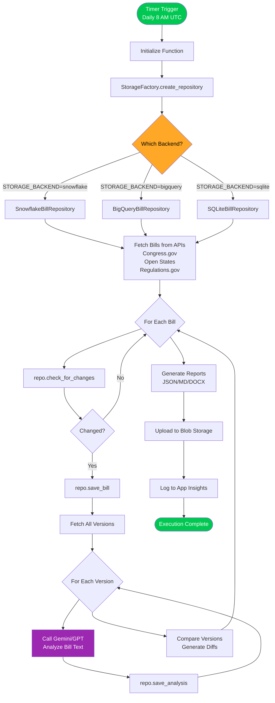

### Change Detection Flow

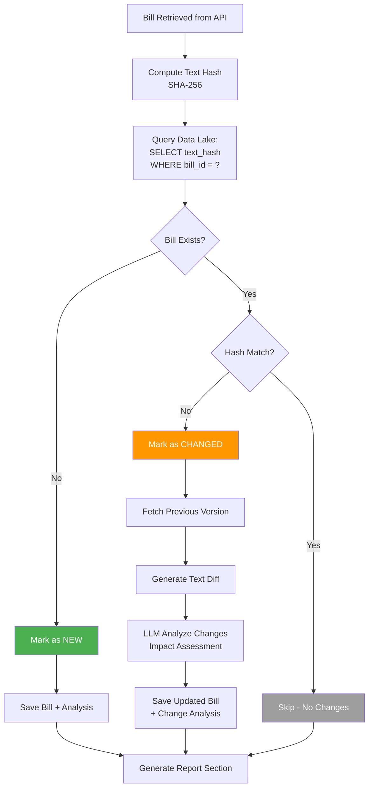

---

## Security Architecture

### Network Security

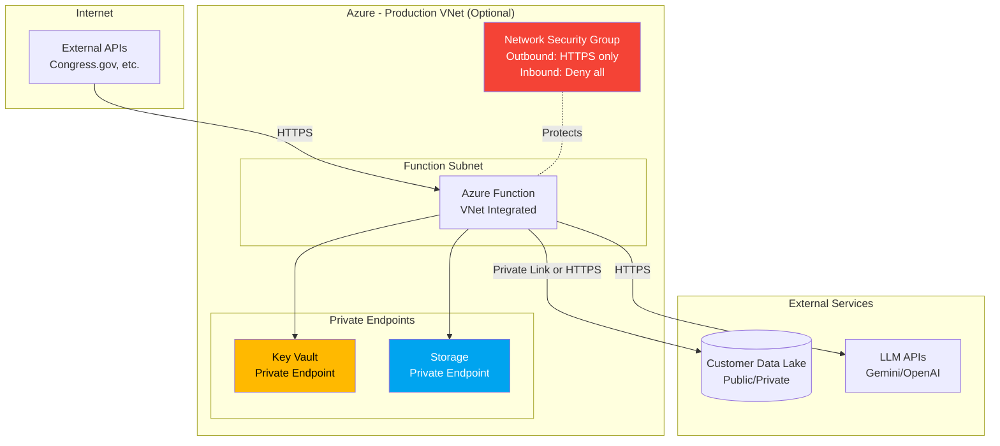

### Identity & Access Management

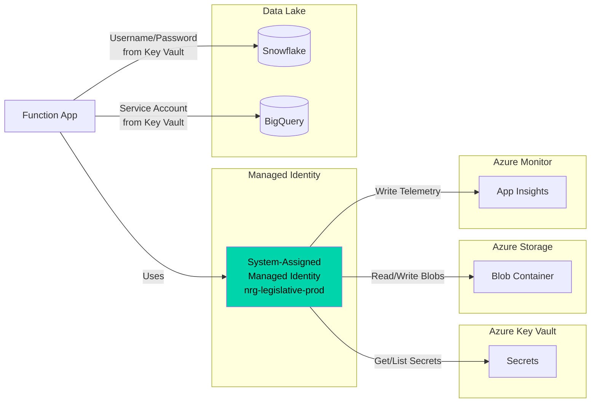

### Security Best Practices Checklist

- ✅ **No hardcoded credentials** - All secrets in Key Vault
- ✅ **Managed Identity** - For Azure-to-Azure auth
- ✅ **HTTPS only** - All API communications encrypted
- ✅ **Least privilege** - Function has minimum required permissions
- ✅ **Secret rotation** - 90-day rotation policy
- ✅ **Network isolation** - VNet integration for production (optional)
- ✅ **Private endpoints** - Key Vault and Storage accessible privately
- ✅ **Audit logging** - All secret access logged in Azure Monitor
- ✅ **IP restrictions** - Limit Key Vault access to Function subnet
- ✅ **MFA enforcement** - For manual Azure Portal access

---

## Deployment Pipeline

### CI/CD Architecture

```mermaid
flowchart LR
    DEV[Developer<br/>Local Dev] -->|Git Push| GITHUB[GitHub Repository]
    
    GITHUB -->|Webhook| ACTIONS[GitHub Actions<br/>Workflow]
    
    subgraph "CI Pipeline"
        ACTIONS --> LINT[Linting<br/>black, flake8]
        LINT --> TEST[Unit Tests<br/>pytest]
        TEST --> BUILD[Build Package<br/>requirements.txt]
    end
    
    BUILD --> GATE{Branch?}
    
    GATE -->|main| DEPLOY_DEV[Deploy to Dev<br/>nrg-legislative-dev]
    GATE -->|release/*| DEPLOY_STAGING[Deploy to Staging Slot<br/>nrg-legislative-prod/staging]
    
    DEPLOY_DEV --> SMOKE_DEV[Smoke Tests]
    DEPLOY_STAGING --> SMOKE_STAGE[Smoke Tests]
    
    SMOKE_STAGE --> MANUAL[Manual Approval]
    MANUAL --> SWAP[Swap Staging to Prod]
    SWAP --> DEPLOY_PROD[Production<br/>nrg-legislative-prod]
    
    DEPLOY_PROD --> MONITOR[Monitor App Insights]
    
    style GITHUB fill:#181717,color:#fff
    style ACTIONS fill:#2088FF,color:#fff
    style DEPLOY_PROD fill:#FF6B6B,color:#fff
    style MANUAL fill:#FFD700,color:#000
```

### GitHub Actions Workflow

**File:** `.github/workflows/deploy-azure-function.yml`

```yaml
name: Deploy to Azure Functions

on:
  push:
    branches:
      - main
      - release/*

env:
  PYTHON_VERSION: '3.9'
  AZURE_FUNCTIONAPP_NAME_DEV: 'nrg-legislative-dev'
  AZURE_FUNCTIONAPP_NAME_PROD: 'nrg-legislative-prod'

jobs:
  build:
    runs-on: ubuntu-latest
    steps:
      - uses: actions/checkout@v3
      
      - name: Set up Python
        uses: actions/setup-python@v4
        with:
          python-version: ${{ env.PYTHON_VERSION }}
      
      - name: Install dependencies
        run: |
          python -m pip install --upgrade pip
          pip install -r requirements.txt
          pip install pytest black flake8
      
      - name: Lint with black and flake8
        run: |
          black --check .
          flake8 . --max-line-length=120
      
      - name: Run tests
        run: |
          pytest tests/ -v --cov=. --cov-report=xml
      
      - name: Upload coverage to Codecov
        uses: codecov/codecov-action@v3
      
      - name: Package function app
        run: |
          mkdir -p package
          cp -r . package/
          cd package && zip -r ../function-app.zip .
      
      - name: Upload artifact
        uses: actions/upload-artifact@v3
        with:
          name: function-app
          path: function-app.zip

  deploy-dev:
    runs-on: ubuntu-latest
    needs: build
    if: github.ref == 'refs/heads/main'
    environment:
      name: Development
    steps:
      - name: Download artifact
        uses: actions/download-artifact@v3
        with:
          name: function-app
      
      - name: Login to Azure
        uses: azure/login@v1
        with:
          creds: ${{ secrets.AZURE_CREDENTIALS_DEV }}
      
      - name: Deploy to Dev
        uses: Azure/functions-action@v1
        with:
          app-name: ${{ env.AZURE_FUNCTIONAPP_NAME_DEV }}
          package: function-app.zip
      
      - name: Smoke test
        run: |
          # Wait for function to warm up
          sleep 30
          # Test health endpoint
          curl -f https://${{ env.AZURE_FUNCTIONAPP_NAME_DEV }}.azurewebsites.net/api/health

  deploy-staging:
    runs-on: ubuntu-latest
    needs: build
    if: startsWith(github.ref, 'refs/heads/release/')
    environment:
      name: Staging
    steps:
      - name: Download artifact
        uses: actions/download-artifact@v3
        with:
          name: function-app
      
      - name: Login to Azure
        uses: azure/login@v1
        with:
          creds: ${{ secrets.AZURE_CREDENTIALS_PROD }}
      
      - name: Deploy to Staging Slot
        uses: Azure/functions-action@v1
        with:
          app-name: ${{ env.AZURE_FUNCTIONAPP_NAME_PROD }}
          slot-name: staging
          package: function-app.zip
      
      - name: Smoke test staging
        run: |
          sleep 30
          curl -f https://${{ env.AZURE_FUNCTIONAPP_NAME_PROD }}-staging.azurewebsites.net/api/health

  deploy-prod:
    runs-on: ubuntu-latest
    needs: deploy-staging
    environment:
      name: Production
    steps:
      - name: Login to Azure
        uses: azure/login@v1
        with:
          creds: ${{ secrets.AZURE_CREDENTIALS_PROD }}
      
      - name: Swap Staging to Production
        run: |
          az functionapp deployment slot swap \
            --resource-group nrg-legislative-rg \
            --name ${{ env.AZURE_FUNCTIONAPP_NAME_PROD }} \
            --slot staging \
            --target-slot production
      
      - name: Monitor deployment
        run: |
          # Check App Insights for errors in last 5 minutes
          echo "Monitoring production for 5 minutes..."
          sleep 300
```

### Infrastructure as Code (Terraform)

**File:** `infrastructure/main.tf`

```hcl
# Resource Group
resource "azurerm_resource_group" "nrg" {
  name     = "nrg-legislative-${var.environment}"
  location = "East US 2"
}

# Storage Account
resource "azurerm_storage_account" "nrg" {
  name                     = "nrg${var.environment}storage"
  resource_group_name      = azurerm_resource_group.nrg.name
  location                 = azurerm_resource_group.nrg.location
  account_tier             = "Standard"
  account_replication_type = "LRS"
}

# Application Insights
resource "azurerm_application_insights" "nrg" {
  name                = "nrg-insights-${var.environment}"
  location            = azurerm_resource_group.nrg.location
  resource_group_name = azurerm_resource_group.nrg.name
  application_type    = "other"
}

# App Service Plan (Function App)
resource "azurerm_service_plan" "nrg" {
  name                = "nrg-plan-${var.environment}"
  location            = azurerm_resource_group.nrg.location
  resource_group_name = azurerm_resource_group.nrg.name
  os_type             = "Linux"
  sku_name            = var.environment == "prod" ? "EP1" : "Y1"
}

# Function App
resource "azurerm_linux_function_app" "nrg" {
  name                       = "nrg-legislative-${var.environment}"
  location                   = azurerm_resource_group.nrg.location
  resource_group_name        = azurerm_resource_group.nrg.name
  service_plan_id            = azurerm_service_plan.nrg.id
  storage_account_name       = azurerm_storage_account.nrg.name
  storage_account_access_key = azurerm_storage_account.nrg.primary_access_key

  site_config {
    application_stack {
      python_version = "3.9"
    }
    always_on = var.environment == "prod"
  }

  app_settings = {
    FUNCTIONS_WORKER_RUNTIME              = "python"
    APPLICATIONINSIGHTS_CONNECTION_STRING = azurerm_application_insights.nrg.connection_string
    STORAGE_BACKEND                       = var.storage_backend
    # Additional settings from Key Vault
  }

  identity {
    type = "SystemAssigned"
  }
}

# Key Vault
resource "azurerm_key_vault" "nrg" {
  name                = "nrg-kv-${var.environment}"
  location            = azurerm_resource_group.nrg.location
  resource_group_name = azurerm_resource_group.nrg.name
  tenant_id           = data.azurerm_client_config.current.tenant_id
  sku_name            = "standard"

  access_policy {
    tenant_id = data.azurerm_client_config.current.tenant_id
    object_id = azurerm_linux_function_app.nrg.identity[0].principal_id

    secret_permissions = ["Get", "List"]
  }
}
```

---

## Monitoring & Observability

### Application Insights Dashboard

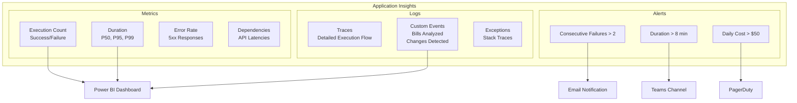

### Key Metrics to Track

**Performance Metrics:**
- Function execution duration (target: < 5 minutes)
- API call latencies:
  - Congress.gov: < 3s per request
  - Open States: < 2s per request
  - Gemini: < 10s per analysis
- Data lake query performance: < 5s
- Memory usage: < 1.5 GB

**Business Metrics:**
- Bills analyzed per run
- New bills detected
- Changes detected (per run)
- LLM token usage (cost tracking)
- Reports generated

**Reliability Metrics:**
- Success rate: > 99%
- API error rate: < 1%
- Data lake connection failures: 0

### Custom Logging

```python
import logging
from azure.monitor.opentelemetry import configure_azure_monitor

# Configure App Insights
configure_azure_monitor()
logger = logging.getLogger(__name__)

def main(timer):
    logger.info("Function execution started", extra={
        "custom_dimensions": {
            "trigger_time": timer.schedule_status['last'],
            "storage_backend": os.getenv('STORAGE_BACKEND')
        }
    })
    
    # Track custom metrics
    logger.metric("bills_analyzed", bill_count, {
        "source": "Congress.gov",
        "changed": changed_count
    })
```

---

## Cost Optimization

### Cost Breakdown by Environment

**Development Environment (Monthly):**
- Function App (Consumption Y1): $0 (free tier)
- Storage Account: $1
- Application Insights: $2
- Key Vault: $0.50
- **Total: ~$3.50/month**

**Production Environment (Monthly):**
- Function App (Premium EP1 or Consumption): $13-50
- Storage Account: $5
- Application Insights: $10
- Key Vault: $1
- Data Lake (customer's): $50-200
- LLM APIs: $15-30
- **Total: ~$94-296/month**

### Cost Optimization Strategies

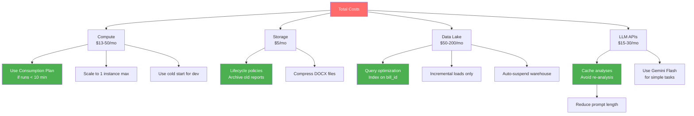

**Recommendations:**
1. **Start with Consumption Plan** - Upgrade to Premium only if timeout is hit
2. **Use Gemini Flash** - 10x cheaper than GPT-4 for most analyses
3. **Cache aggressively** - Avoid re-analyzing unchanged bills
4. **Optimize data lake queries** - Use indexes, limit SELECT *
5. **Archive old reports** - Move to Cool/Archive tiers after 30 days

---

## Summary

### Architecture Highlights

✅ **Serverless** - No infrastructure management  
✅ **Scalable** - Ready for multi-customer deployment  
✅ **Secure** - Key Vault, Managed Identity, network isolation  
✅ **Observable** - Full telemetry via App Insights  
✅ **Pluggable Storage** - Swap data lakes via env vars  
✅ **CI/CD Ready** - Automated deployment pipeline  
✅ **Cost-Optimized** - ~$70-220/month production  

### Quick Start Checklist

**Phase 1: Infrastructure Setup (Day 1)**
- [ ] Create resource group in Azure Portal
- [ ] Deploy Terraform/ARM templates
- [ ] Create Key Vault and add secrets
- [ ] Configure Managed Identity permissions
- [ ] Set up Application Insights

**Phase 2: Code Deployment (Day 2-3)**
- [ ] Refactor POC to use Repository Pattern
- [ ] Implement chosen storage adapter (Snowflake/BigQuery/etc.)
- [ ] Configure GitHub Actions workflow
- [ ] Deploy to Dev environment
- [ ] Test end-to-end execution

**Phase 3: Production Launch (Day 4-5)**
- [ ] Deploy to Staging slot
- [ ] Perform smoke tests
- [ ] Configure alerts in App Insights
- [ ] Swap to Production
- [ ] Monitor first 3 executions
- [ ] Document runbook for operations team

### Next Steps

1. **Choose data lake platform** with customer
2. **Provision Azure resources** via Terraform
3. **Refactor code** to Repository Pattern
4. **Deploy to Dev** and validate
5. **Launch Production** with monitoring

All diagrams and architecture patterns are production-ready. Adjust scaling/pricing tiers based on actual usage patterns after first month.
