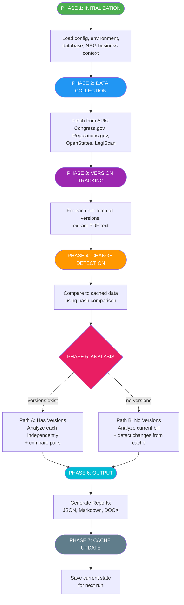
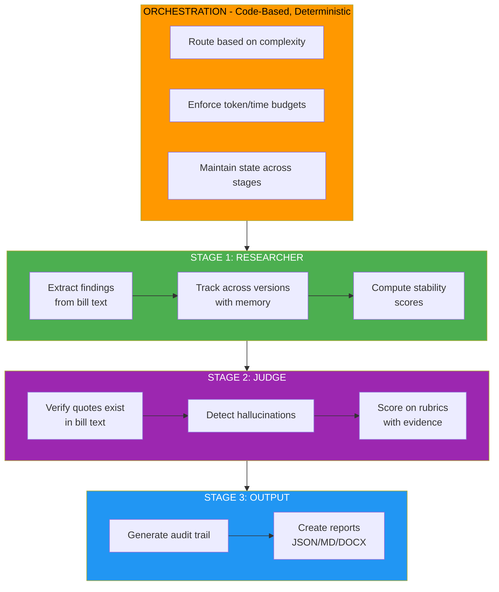
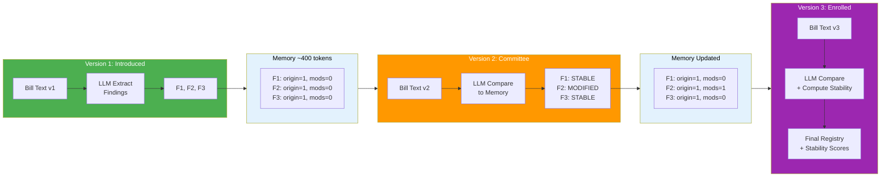
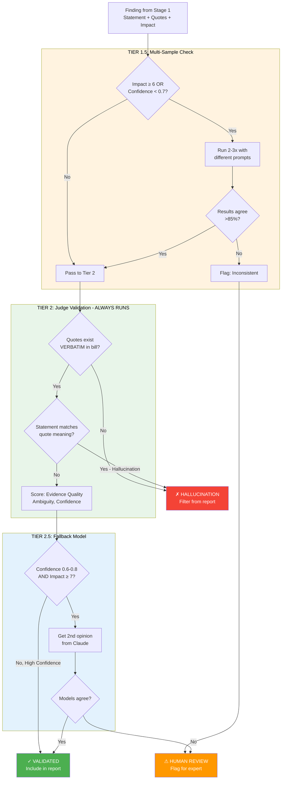
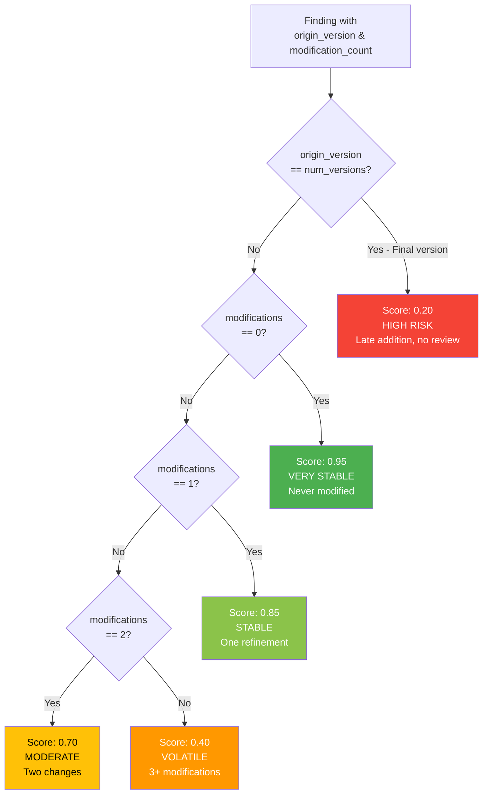
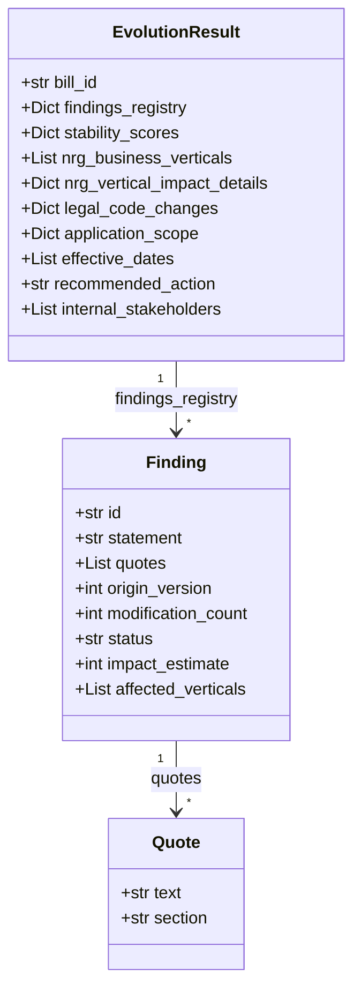
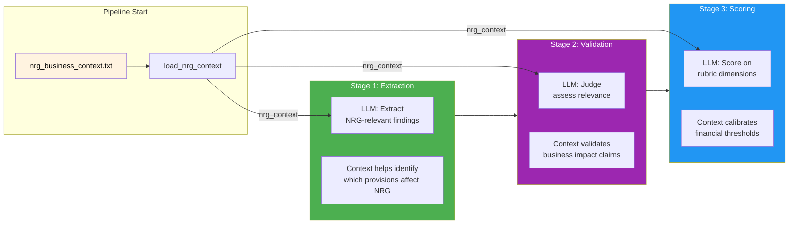
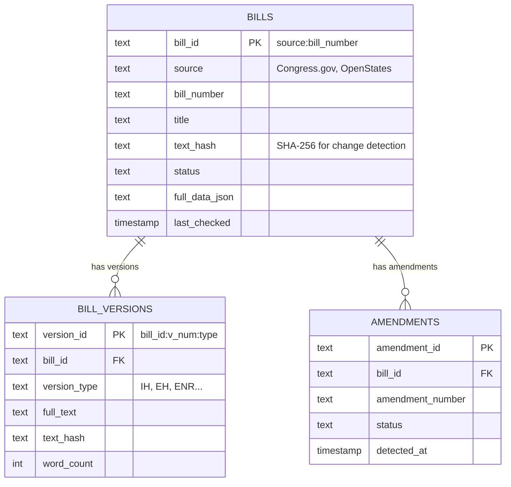
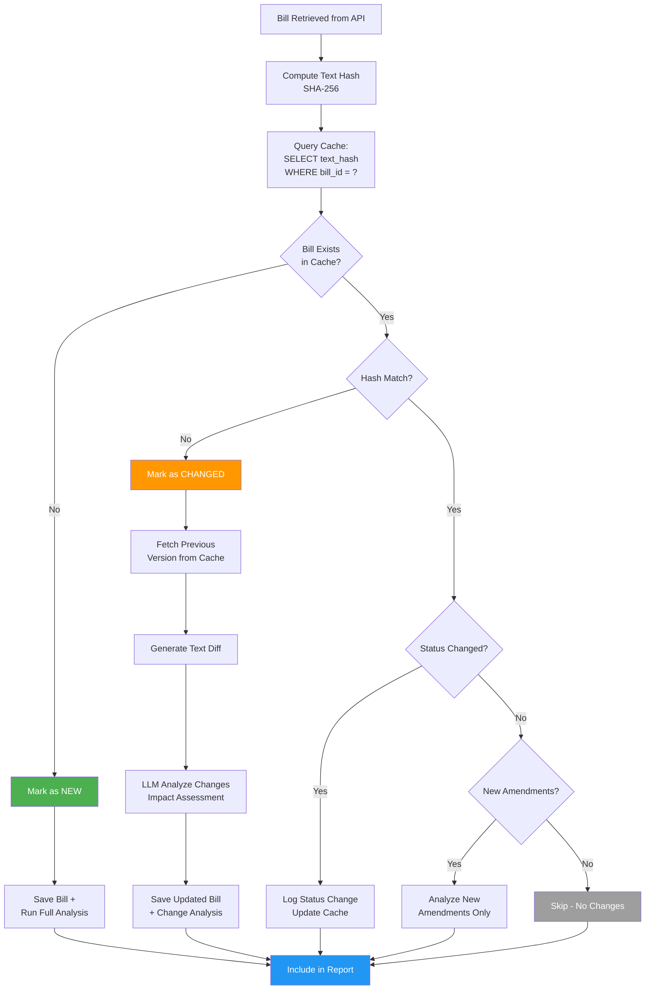

## Document References

| Topic | Reference Document | Section |
|-------|-------------------|---------|
| Business Requirements | `docs/BUSINESS REQUIREMENTS.md` | Full document |
| API Specifications | `docs/BP_LEGISLATIVE_INTELLIGENCE_SPEC 1.md` | Data Sources section |
| POC 2 Architecture | `docs/poc doc/poc 2 architecture.md` | Pipeline Flow diagram |
| POC 2 Limitations | `docs/poc doc/DEBRIEF.md` | Limitations & Technical Debt |
| v2 Architecture | `docs/redesign/Architecture_v2.md` | System Overview, all stages |
| Sample Output (POC2) | `nrg_analysis_20260126_175535/` | All files |
| API Implementations | `nrg_core/api/congress.py`, `openstates.py`, `regulations.py` | Schema definitions |
| v2 Implementation | `nrg_core/v2/` | All modules |

---

## Section 1: Business Problem & Goals

> "NRG's Legal team manually tracks legislative bills across 50 states plus federal. We're building an AI system to automate this - from discovery to analysis to actionable recommendations."

### Key Points

**What we're building:**
- Legislative agent for NRG Energy
- Monitors federal + state legislation affecting NRG operations
- Provides automated AI analysis with actionable insights grounded in NRG business context

**Business Goals:**
- Automate bill discovery and monitoring
- Generate NRG-specific impact analysis with scoring
- Track bill versions and detect meaningful changes
- Produce reports (DOCX/PDF) + email notifications

**Acceptance Criteria:**
- Integration with Congress.gov, Regulations.gov, OpenStates APIs
- Data storage in NRG data lake (RAG corpus for chatbot)
- Automated email delivery with actionable insights
- Impact scoring with recommended actions

---

## Section 2: Domain Context & Prerequisites

### 2A. What are Legislative Bills?

**Definition:** Formal proposals that can become laws through the legislative process.

**Example (Congress.gov):**
> **Reference:** `docs/data_examples/congress_bill_example_hr150.json`

```json
{
  "bill": {
    "congress": 118,
    "number": "150",
    "type": "HR",
    "title": "Protecting American Energy Production Act",
    "introducedDate": "2023-01-09",
    "originChamber": "House",
    "policyArea": { "name": "Energy" },
    "latestAction": {
      "actionDate": "2023-02-21",
      "text": "Referred to the Subcommittee on Energy and Mineral Resources."
    },
    "sponsors": [{
      "fullName": "Rep. Duncan, Jeff [R-SC-3]",
      "party": "R",
      "state": "SC"
    }],
    "cosponsors": { "count": 22 },
    "textVersions": { "count": 1, "url": "https://api.congress.gov/v3/bill/118/hr/150/text" }
  }
}
```

**Key fields we use:**
- `congress` - Session number (118th = 2023-2025) - **critical for unique bill ID**
- `type` + `number` - Bill identifier (HR 150 = House Bill 150)
- `latestAction` - Where it is in the legislative process
- `policyArea` - For filtering relevant bills (Energy, Environment, etc.)
- `textVersions.url` - Endpoint to fetch full bill text for analysis

### Federal Bill Types Explained

| Type | Full Name | What It Does | Becomes Law? | Track for NRG? |
|------|-----------|--------------|--------------|----------------|
| **H.R.** | House Bill | Creates/amends federal law | YES | **CRITICAL** - Primary focus |
| **S.** | Senate Bill | Creates/amends federal law | YES | **CRITICAL** - Primary focus |
| **H.J.Res / S.J.Res** | Joint Resolution | Same as bills + Constitutional amendments | YES* | **HIGH** - Continuing resolutions affect agency funding |
| **H.Con.Res / S.Con.Res** | Concurrent Resolution | Budget resolutions, Congress operations | NO | **MEDIUM** - Budget affects regulatory enforcement |
| **H.Res / S.Res** | Simple Resolution | Internal chamber rules, commemorations | NO | **LOW** - Rarely impacts business |

*Constitutional amendments require state ratification, not presidential signature

**Why This Matters for NRG:**
- H.R. and S. bills are where energy policy changes happen
- H.R. 150 example: Prohibits executive moratorium on hydraulic fracturing - directly affects NRG operations
- Our system currently focuses on H.R. bills; S. bills will be added for full coverage

### 2B. Regulations vs. Bills

> **Clarification:** Regulations are NOT part of bills. They are separate legal instruments created by different branches of government.

| Aspect | Legislative Bills | Regulations |
|--------|------------------|-------------|
| **Creator** | Congress (Legislative Branch) | Federal Agencies (Executive Branch) |
| **Purpose** | Set broad policy mandates | Implement law with specific details |
| **Example** | "Clean air standards must be maintained" | "Emissions cannot exceed X ppm" |
| **Where Found** | Congress.gov | Regulations.gov, Federal Register |
| **Becomes Law?** | Yes, after passing both chambers + President | Yes, after notice-and-comment period |

**The Pipeline:**
```
Bill Passed → Law Signed → Agency Studies Law → Proposed Rule (NPRM)
→ Public Comment → Final Rule → Codified in CFR
```

**Example (Regulations.gov):**
> **Reference:** `docs/data_examples/regulations_example.json`

```json
{
  "data": [{
    "id": "PHMSA-2016-0004-0040",
    "type": "documents",
    "attributes": {
      "documentType": "Supporting & Related Material",
      "lastModifiedDate": "2025-09-11T22:58:16Z",
      "agencyId": "PHMSA",
      "title": "Tennessee Gas Pipeline Attachment A",
      "docketId": "PHMSA-2016-0004",
      "withdrawn": false,
      "openForComment": false
    }
  }]
}
```

**Key fields:**
- `id` - Unique document identifier
- `docketId` - Groups related documents (PHMSA-2016-0004 = pipeline safety docket)
- `agencyId` - PHMSA = Pipeline and Hazardous Materials Safety Administration
- `lastModifiedDate` - Only change indicator available (⚠️ NO version history!)
- `openForComment` - Whether public comments are being accepted

**Why Track Both for NRG:**
- Bills set policy direction (we should SUPPORT/OPPOSE)
- Regulations define compliance requirements (we MUST follow)
- Example: Congress passes pipeline safety bill → PHMSA writes specific safety regulations → NRG must comply

### 2C. Data Sources

> **Reference:** `docs/NRG_LEGISLATIVE_INTELLIGENCE_SPEC 1.md` - Data Sources section

| Source | Coverage | Rate Limit | Cost | Key Endpoint |
|--------|----------|------------|------|--------------|
| **Congress.gov** | Federal bills | 5,000/hr | Free | `/bill/{congress}/{type}/{number}` |
| **Regulations.gov** | Federal regulations | 1,000/hr | Free | `/v4/documents` |
| **OpenStates** | 50 states + DC + PR | Variable | $59/mo | `/bills`, `/bills/{id}` |

**Why OpenStates is PRIMARY for State Bills:**
- Only API providing unified access to ALL 50 states
- Modern REST API with full-text search
- Bill versions available as PDF links
- Excellent filtering by jurisdiction, session, update date

**API Return Schemas:**
> **Reference:** `nrg_core/api/congress.py` lines 100-130, `openstates.py` lines 350-380

### 2D. Bill Versions

> **This is the key insight for understanding architecture choices.**

**Example:**

**Federal Bill (Congress.gov H.R. 21 - 3 versions):**
> **Reference:** `docs/data_examples/congress_bill_multiversion_hr21.json`

```json
{
  "textVersions": [
    {
      "date": "2023-01-30T05:00:00Z",
      "type": "Referred in Senate",           // ← Federal terminology
      "formats": [
        { "type": "PDF", "url": "https://www.congress.gov/118/bills/hr21/BILLS-118hr21rfs.pdf" }
      ]
    },
    {
      "date": "2023-01-27T05:00:00Z",
      "type": "Engrossed in House",
      "formats": [{ "type": "PDF", "url": "...BILLS-118hr21eh.pdf" }]
    },
    {
      "date": "2023-01-09T05:00:00Z",
      "type": "Introduced in House",
      "formats": [{ "type": "PDF", "url": "...BILLS-118hr21ih.pdf" }]
    }
  ]
}
```

**State Bill (OpenStates - Texas SB 8 - 5 versions):**
> **Reference:** `docs/data_examples/openstates_bill_with_versions.json`

```json
{
  "identifier": "SB 8",
  "versions": [
    { "note": "Enrolled", "links": [{"url": "...SB00008F.PDF"}] },
    { "note": "House Committee Report", "links": [{"url": "...SB00008H.PDF"}] },
    { "note": "Engrossed", "links": [{"url": "...SB00008E.PDF"}] },
    { "note": "Senate Committee Report", "links": [...] },
    { "note": "Introduced", "links": [...] }
  ]
}
```

**Notice the naming differences:** Congress.gov uses `"type": "Introduced in House"` while OpenStates uses `"note": "Introduced"`

**Version Naming is NOT Standardized Between Sources:**

| Legislative Stage | Congress.gov | OpenStates | Meaning |
|-------------------|--------------|------------|---------|
| Initial filing | `IH`, `IS` | `Introduced`, `As Filed`, `Filed` | Original bill text |
| Committee review | `RH`, `RS` | `Committee Report`, `House Committee Report` | Modified by committee |
| Passed chamber | `EH`, `ES` | `Engrossed` | Passed originating chamber |
| Final enacted | `ENR` | `Enrolled`, `Chaptered`, `Signed` | Final version |

**POC 2 Problem:** Stores version names as-is from each API - NO normalization
- Federal bills show: `"Introduced in House"`
- State bills show: `"Enrolled"`, `"Committee Report"`
- Reports are inconsistent, analytics can't aggregate across sources

**v2 Solution:** Normalizes ALL versions to federal codes
> **Reference:** `nrg_core/utils.py` lines 33-79 - `VERSION_TYPE_MAP` and `normalize_version_type()`

```python
VERSION_TYPE_MAP = {
    "Introduced": "IH",
    "As Filed": "IH",
    "Engrossed": "EH",
    "Enrolled": "ENR",
    "Chaptered": "ENR",  # California-specific
}
```

**Why Version Tracking Matters:**

When we fetch a bill from the API, we get the **latest version only**. But bills change substantially:

**Real Example - Texas HB 4238 (5 versions):**
| Version | Impact Score | Key Change |
|---------|--------------|------------|
| v5 (Introduced) | 6/10 | Broad consumer protection, easy to trigger |
| v4 (House Committee) | 4/10 | Same provisions |
| v3 (Engrossed) | 4/10 | Still broad |
| v2 (Senate Committee) | 4/10 | **REMOVED** police report/FTC report triggers |
| v1 (Enrolled - Final) | 3/10 | Only court orders trigger; 7-day compliance window |

**Why Analyze All Versions:**
1. **Stability Tracking:** A finding present since v1 (survived 5 versions) = 95% stable, likely final
2. **Late Additions:** A finding added in final version = 20% stable, may change in implementation
3. **Informed Recommendations:** "This provision was heavily contested (3 modifications) - monitor closely"

> **This is WHY we implement version tracking. POC 2 and v2 differ in HOW they do it - we'll cover this in the architecture section.**

### 2E. Bill Versions vs. Bill Changes - Key Distinction

| Aspect | Bill Versions | Bill Changes |
|--------|---------------|--------------|
| **What causes it** | Legislative action (committee votes, floor passage) | Anything we detect between pipeline runs |
| **Created by** | Congress/Legislature | Our change detection system |
| **Examples** | Introduced → Engrossed → Enrolled | Text edit, status update, new amendment, new version |
| **Frequency** | Major milestones (3-7 per bill) | Any modification (could be daily) |
| **What we do** | Sequential Evolution analysis (Stage 1) | Hash comparison + diff generation |

**In short:**
- **Version** = Official legislative snapshot (formal milestone in the process)
- **Change** = Any difference we detect between runs (could be a new version, OR just a text fix/status update)

A "new version" is one type of change. When detected, it triggers full Sequential Evolution analysis. Other changes (text fixes, status updates) get lightweight diff analysis only.

---

## Section 3: POC 2 Walkthrough

### 3A. High-Level Architecture

> **Reference:** `docs/poc doc/poc 2 architecture.md` - Pipeline Flow diagram

**7-Phase Pipeline:**



**POC 2 Problem:** Each version analyzed independently (no memory between versions)

**API Return Schema Reference:**
> **Reference:** `nrg_core/models.py` - `Bill`, `BillVersion`, `Analysis` dataclasses

### 3B. POC 2 Output Example

> **Reference:** `nrg_analysis_20260126_175535/` directory

**Output Structure:**
```
nrg_analysis_20260126_175535/
├── nrg_analysis_20260126_175535.json    # 2,683 lines, structured data
├── nrg_analysis_20260126_175535.md      # 1,051 lines, human-readable
└── nrg_analysis_20260126_175535.docx    # Word document
```

**Key Output Elements:**

1. **Impact Scoring (0-10 scale):**
   - H.R. 150: 8/10 (Hydraulic Fracturing Protection) - SUPPORT
   - H.R. 21: 7/10 (Strategic Petroleum Reserve) - SUPPORT
   - HB 4238: 3/10 (Texas Identity Theft) - MONITOR

2. **Version Analysis with Score Evolution:**
   - HB 4238: 5 versions analyzed, score changed 6 -> 4 -> 4 -> 4 -> 3
   - Shows how bill became less impactful as it progressed

3. **Semantic Diff Analysis:**
   > **Reference:** JSON file lines 1438-1495 - `version_diffs` with `semantic_analysis`

   ```json
   "semantic_analysis": {
     "key_provisions_added": [...],
     "key_provisions_removed": [...],
     "key_provisions_modified": [...],
     "impact_evolution": "Score increased from 3 to 4 because...",
     "compliance_changes": "NRG must update procedures...",
     "strategic_significance": "This represents a deterioration..."
   }
   ```

4. **Business-Specific Outputs:**
   - `nrg_business_verticals`: Natural Gas, Retail, General Business
   - `affected_nrg_assets`: Generation facilities, geographic exposure, business units
   - `internal_stakeholders`: Who to notify (Legal, Gov Affairs, Operations)

### 3C. Challenges That Led to Redesign

> **Reference:** `docs/poc doc/DEBRIEF.md` - Limitations & Technical Debt

**Problem-Focused Analysis:**

#### Problem 1: Token Cost Explosion (Version Analysis)

**The Issue:**
- Each version analyzed independently (no memory of previous versions)
- 5 versions + 4 diffs = **9 separate LLM analyses per bill**
- Each analysis ~6,700 tokens → **60,000+ tokens per bill**

**Why It's a Problem:**
- Cost: $0.10-0.50 per run becomes $1-5+ with many multi-version bills
- Latency: 9 sequential LLM calls = 45-90 seconds per bill
- No efficiency gain from understanding version 1 before analyzing version 2

#### Problem 2: No Evidence or Reasoning Trail

**The Issue:**
- LLM outputs impact score and recommendations but no:
   - No verifiable quotes from bill text
   - No reasoning showing HOW the conclusion was reached

**Questions We Can't Answer from LLM Response:**
- Which specific facts led to this conclusion?
- What sources support this finding?
- What would falsify this interpretation?
- Which assumptions are critical?

**Impact:** Legal team can't trust or verify the analysis without manually reading the bill

#### Problem 3: Hallucination Risk (No Validation)

**The Issue:**
- LLM extracts "findings" without verification and could confidently state "Section 5.2 requires..." when Section 5.2 doesn't exist
- No check that quoted text actually exists in bill
- No second opinion on high-stakes findings

#### Problem 4: Version Naming Inconsistency

**The Issue:**
- Congress.gov returns: `"Introduced in House"`, `"IH"`
- OpenStates returns: `"Enrolled"`, `"As Filed"`, `"Chaptered"`
- POC 2 stores them as-is with no normalization

**Impact:**
- Reports show different terminology for same legislative stage
- Can't aggregate or compare across federal vs state bills
- Analytics queries fail on version type filters

#### Problem 5: Fail-Soft Error Handling Masks Failures

**The Issue:**
> **Reference:** `docs/poc doc/poc 2 architecture.md` - lines 72-93

- API failure → returns empty list `[]`
- LLM analysis failure → returns `{"error": "...", "business_impact_score": 0}`
- PDF extraction failure → returns `None`, falls back to short abstract

**Impact:** Bills appear "low priority" (score=0) when actually analysis failed. No alert generated.

#### Problem 6: Single-Model Dependency

**The Issue:**
- Entire pipeline depends on one LLM provider (Gemini or OpenAI)
- If that model has blind spots or biases, ALL analysis is affected
- No architectural diversity to catch different types of errors

---

## Section 4: Redesign v2 Architecture

### Architecture Pattern Overview

> **Reference:** `docs/redesign/Architecture_v2.md` - System Overview Diagram

**Researcher-Judge with Code Orchestration:**



**Key Difference from POC 2:** Code orchestrates LLM calls (not LLM deciding what to do next)

### 4A. Stage 1: Sequential Evolution

> **Reference:** `docs/redesign/Architecture_v2.md` - Stage 1 section (lines 87-99)
> **Implementation:** `nrg_core/v2/sequential_evolution.py`

**POC 2 Problem:** Analyzed each version independently = 60K tokens

**v2 Solution:** Walk versions chronologically with ~500-token memory state



**Token Savings:** 31K tokens vs 60K = **48% reduction** (memory carries forward, no redundant extraction)

**Why this design choice:**

1. **Stability Scoring Enables Risk Prediction:**

   **Key concept:** `origin_version` = the version number where a finding FIRST appeared

   **Example:** Bill with 5 versions (v1=Introduced → v5=Enrolled)
   ```
   F1: origin_version=1, modifications=0 → stability=0.95 (survived all versions, likely final)
   F2: origin_version=1, modifications=2 → stability=0.70 (two changes, somewhat volatile)
   F3: origin_version=5, modifications=0 → stability=0.20 (late addition, HIGH RISK)
   ```

   **Why F3 is HIGH RISK (origin_version=5 on a 5-version bill):**
   - F3 was added in the **final version** (Enrolled) - it didn't exist in v1, v2, v3, or v4
   - Formula: `if origin_version == num_versions → score = 0.20`
   - This provision **never went through** committee review, floor debate, or amendment process
   - Could be: last-minute compromise, or something that may change during regulatory implementation

   **Contrast:**
   - F1 (origin=1): Present since day one, survived 4 rounds of review → stable and legal team can plan around it
   - F3 (origin=5): Added at the last minute, no review history → monitor closely, may change

2. **Informed Legal Recommendations:**
   - "F1 has been stable since introduction - safe to plan around"
   - "F3 was added in final version - may change during implementation/rulemaking"
   - "F2 was modified twice - contentious provision, watch for further amendments"

3. **Modification Tracking Shows Contention:**
   - Finding modified 3+ times = contentious provision, expect amendments

> **Reference:** `nrg_core/v2/sequential_evolution.py` lines 246-286 - stability scoring formula

### 4B. Stage 2: Two-Tier Validation

> **Reference:** `docs/redesign/Architecture_v2.md` - Stage 2 section
> **Implementation:** `nrg_core/v2/two_tier.py`

**The Problem v2 Solves:** No validation = hallucination risk + no evidence trail



**Tier 1.5: Multi-Sample Consistency Check**

| Trigger Condition | Action |
|-------------------|--------|
| Impact ≥ 6 (high stakes) | Run analysis 2-3x with different prompts |
| Confidence < 0.7 (uncertain) | Compare results for >85% agreement |

**Why Multi-Sample?**
- LLMs are non-deterministic - same prompt can give different findings
- **Scenario:** LLM extracts "NRG must divest coal assets" from ambiguous text
- Multi-sample check: Run 3x, only 1 of 3 extracts this → likely hallucination
- Multi-sample check: Run 3x, all 3 extract this → high confidence finding

**Implementation:** TF-IDF + cosine similarity measures semantic agreement

**Tier 2: Judge Validation (ALWAYS RUNS)**

For every finding, the Judge verifies:
1. **Quote Verified:** Do all quoted texts exist VERBATIM in bill? (exact string match)
2. **Hallucination Detected:** Does statement claim things not in the quotes?
3. **Evidence Quality (0-1):** How well do quotes support the statement?
4. **Ambiguity (0-1):** How much interpretation is required?
5. **Judge Confidence (0-1):** Overall validation confidence

**What "Hallucination Detected" Means:**

> **Reference:** `reports/nrg_analysis_20260126_215240/nrg_analysis_20260126_215240.md` - Finding 6

```markdown
**Finding 6** ✗ [Hallucination - Filtered]

> The bill imposes a windfall profits excise tax on crude oil extracted or imported
> by covered taxpayers, which could significantly impact NRG's profitability.

- Confidence: 0.90
- Impact Estimate: 8/10
- Evidence Quality: 0.50

Note: high confidence (0.90) + high impact (8/10) findings can still be flagged as hallucinations when evidence quality is poor  

*Supporting Evidence:*
> "In each calendar quarter there is hereby imposed on any covered taxpayer an
> excise tax at the rate determined under subsection (b)..." — §5896(a)
```

**What Happened:**
- Researcher extracted a finding with high confidence (0.90) and high impact (8/10)
- Judge checked: Does the quote exist in bill text?    YES
- Judge checked: Does the statement accurately reflect the quote?    PARTIALLY
- Evidence Quality scored only 0.50 - the statement makes claims beyond what the quote supports
- **Result:** Finding flagged as hallucination, filtered from final report, available for human review

**Tier 2.5: Fallback Second Model (CONDITIONAL)**

| Trigger Condition | Action |
|-------------------|--------|
| Judge confidence 0.6-0.8 (uncertain) AND Impact ≥ 7 (high stakes) | Get second opinion from Claude (or different provider) |

**Why Different Provider?**
- OpenAI and Claude have different architectures, training data, biases
- If both agree → confidence +0.1
- If they disagree → flag for expert human review
- Architectural diversity catches errors that one model might consistently make

### 4C. Stage 3: Rubric-Based Scoring

> **Reference:** `docs/redesign/Architecture_v2.md` - Rubric Scoring section
> **Implementation:** `nrg_core/v2/rubrics.py`

**The Problem v2 Solves:** POC 2 scores were a black box

**Four Dimensions (each 0-10):**

| Dimension | What It Measures | Scale Anchors |
|-----------|------------------|---------------|
| **Legal Risk** | Regulatory/legal exposure | 0-2: None, 6-8: Significant fines, 9-10: Existential |
| **Financial Impact** | Dollar cost to NRG | 0-2: <$100K, 6-8: $500K-$5M, 9-10: >$5M |
| **Operational Disruption** | Process/system changes | 0-2: None, 6-8: System overhaul, 9-10: Business model change |
| **Ambiguity Risk** | Interpretation uncertainty | 0-2: Crystal clear, 6-8: Significant ambiguity, 9-10: Novel/vague |

**What is a Rubric Anchor Reference?**

Each score includes:
```json
{
  "dimension": "legal_risk",
  "score": 7,
  "rationale": "Bill introduces mandatory compliance requirements with penalties up to $500K per violation...",
  "evidence": ["§5.2: 'Operators shall be subject to civil penalties not exceeding $500,000...'"],
  "rubric_anchor": "6-8: Significant regulatory exposure with material fines"
}
```

**Why Rubric Anchors Matter:**
1. **Calibration:** Experts can review "Is this really a 7?" by checking the anchor definition
2. **Consistency:** Different LLM runs produce similar scores because they reference same scale
3. **Audit Trail:** Legal team knows exactly WHY a score was assigned
4. **Expert Override:** "The anchor says 6-8, but given NRG's specific situation, this is actually 9"

> **Reference:** `nrg_core/v2/rubrics.py` lines 18-65 - Full rubric definitions

### 4D. Summary: How v2 Solves POC 2 Problems

| POC 2 Problem | v2 Solution | Benefit |
|---------------|-------------|---------|
| Token explosion (60K/bill) | Sequential memory | 48% cost savings (31K/bill) |
| No lineage context | Stability scoring | Predict which findings will survive |
| No validation | Two-tier + hallucination detection | Trustworthy, verifiable findings |
| Single-model risk | Tier 2.5 fallback to Claude | Architectural diversity |
| No audit trail | Rubric scoring + evidence quotes | Full traceability for legal review |
| LLM variability | Multi-sample consistency checks | Catch non-deterministic errors |
| Inconsistent version names | `normalize_version_type()` | Unified taxonomy across sources |

---

## Section 5: Demo & Q&A

1. **POC 2 Markdown Report:**
   > File: `nrg_analysis_20260126_175535/nrg_analysis_20260126_175535.md`
   - Impact score distribution (High/Medium/Low)
   - Version timeline for HB 4238

2. **v2 Output:**
   > File: `reports/nrg_analysis_20260126_215240/nrg_analysis_20260126_215240.md`
   - Hallucination detection markers (✓ vs ✗)
   - Confidence scores and quotes
   - Judge validation results

3. **Bill Text:**
   > File: JSON - `"full_text"` field
   - Point out SEC. 1. SHORT TITLE, SEC. 2. main provisions

---

## Implementation Status

> **Reference:** `docs/redesign/Architecture_v2.md` - lines 63-64

| Component | Status |
|-----------|--------|
| Sequential Evolution (Stage 1) | **Implemented** |
| Two-Tier Validation (Stage 2) | **Implemented** |
| Rubric Scoring (Stage 3) | **Implemented** |
| Audit Trail Generation | **Implemented** |
| Multi-model fallback (Claude) | **Implemented** |
| Version normalization | **Implemented** |
| Complexity-based routing (STANDARD path) | **Planned** |
| Budget enforcement | **Planned** |
| Deep Research (external context) | **Optional, disabled** |

---

## Roadmap

1. **Validation:** Run v2 on 20-30 bills, compare to human expert analysis
2. **Integration:** Connect to NRG data lake and email notifications
3. **Coverage:** Add S. (Senate bills) to Congress.gov fetching
4. **Efficiency:** Implement STANDARD path for simple single-version bills
5. **Monitoring:** Add dashboard for tracking API status and analysis failures

---

## APPENDIX A: V2 Pipeline Deep Dive

### A1. Stage 1: Sequential Evolution - Technical Details

> **Reference:** `nrg_core/v2/sequential_evolution.py`

#### INPUTS

```python
List[BillVersion] where each BillVersion contains:
- version_number: int      # Sequential: 1, 2, 3...
- text: str                # Full bill text (extracted from PDF)
- name: str                # Version label: "Introduced", "Engrossed", etc.
```

#### LLM PROMPT INSTRUCTIONS

> **Reference:** `nrg_core/v2/sequential_evolution.py` lines 100-192

```
Analyze this bill (Version 1: {version_name}).

BILL TEXT: {bill_text}

Extract findings that could impact NRG Energy's business.
Assign IDs (F1, F2, etc.) and include supporting quotes from the bill.

REQUIREMENTS:
1. Each finding MUST have at least one verbatim quote from the bill
2. Include the section reference for each quote
3. Estimate impact 0-10 (0=no impact, 10=existential threat)
4. Identify which NRG business verticals are impacted
5. Extract legal analysis details (code changes, application scope, effective dates)
6. Classify provisions as mandatory (SHALL/MUST) or permissive (MAY)

CRITICAL: Every statement must be supported by a direct quote from the bill.
```

#### LLM PROMPT INSTRUCTIONS (VN - Subsequent Versions)

```
Analyze Version {version_number}: {version_name}.

PREVIOUS FINDINGS (from memory): {previous_findings}
NEW VERSION TEXT: {bill_text}

TASK:
1. Compare to previous findings
2. Mark findings as: STABLE (unchanged), MODIFIED (changed), or NEW
3. Update modification counts
4. Update quotes if text changed
```

#### FINDING REGISTRY ATTRIBUTES

Each finding in the registry contains:

| Attribute | Type | Description |
|-----------|------|-------------|
| `id` | str | Finding ID (F1, F2, etc.) |
| `statement` | str | Clear finding statement |
| `quotes` | List[{text, section}] | Verbatim quotes with section refs |
| `origin_version` | int | Version number where finding FIRST appeared (1 = introduced, higher = added later) |
| `modification_count` | int | Times this finding was modified across versions |
| `status` | str | STABLE, MODIFIED, or NEW |
| `impact_estimate` | int | 0-10 impact score |
| `affected_verticals` | List[str] | NRG business verticals impacted |

#### STABILITY SCORING FORMULA

> **Reference:** `nrg_core/v2/sequential_evolution.py` lines 427-467

**Key insight:** `origin_version` compared to `num_versions` (total versions) determines if finding is early or late addition.

```python
def _compute_stability(registry, num_versions):
    for finding in registry:
        origin = finding["origin_version"]   # Which version did this finding first appear?
        mods = finding["modification_count"]

        if origin == num_versions:      # origin=5 on 5-version bill → added in FINAL version
            score = 0.20                # HIGH RISK: no legislative review, may change
        elif mods == 0:                  # Present since early version, never changed
            score = 0.95                # VERY STABLE: survived all reviews
        elif mods == 1:                  # One refinement along the way
            score = 0.85
        elif mods == 2:                  # Two changes
            score = 0.70
        else:                            # 3+ modifications = contentious
            score = 0.40
```

**Stability Scoring Decision Flow:**



**Example:** Bill with 5 versions (Introduced → Enrolled)
```
F1: origin=1, mods=0 → 0.95  // Present since v1, never changed - very stable
F2: origin=1, mods=2 → 0.70  // Present since v1, modified twice - somewhat volatile
F3: origin=5, mods=0 → 0.20  // Added in v5 (final) - HIGH RISK, no review history
```

#### OUTPUTS



**Field Descriptions:**
```python
@dataclass
class EvolutionResult:
    bill_id: str
    findings_registry: Dict[str, Dict]    # All findings with metadata
    stability_scores: Dict[str, float]    # Stability score per finding (0-1)
    nrg_business_verticals: List[str]     # Bill-level vertical list
    nrg_vertical_impact_details: Dict     # Vertical → impact description
    legal_code_changes: Dict              # sections_added, sections_amended
    application_scope: Dict               # applies_to, exclusions, geographic
    effective_dates: List[Dict]           # date, applies_to pairs
    recommended_action: str               # ignore|monitor|engage|urgent|support
    internal_stakeholders: List[str]      # NRG departments to notify
```

---

### A2. Stage 2: Two-Tier Validation - Technical Details

> **Reference:** `nrg_core/v2/two_tier.py`, `nrg_core/v2/judge.py`

#### INPUTS

From Stage 1:
- `findings_registry`: Dict of findings with quotes and impact estimates
- `stability_scores`: Dict mapping finding_id → stability (0-1)
- `bill_text`: Full bill text for verification
- `nrg_context`: NRG business context for relevance scoring

#### JUDGE VALIDATION PROMPT

> **Reference:** `nrg_core/v2/judge.py` lines 81-111

```
You are a validation judge for legislative analysis.

BILL TEXT: {bill_text}

FINDING TO VALIDATE:
Statement: {statement}
Quotes: {quotes}

TASK: Validate this finding by checking:
1. Do all quoted texts exist VERBATIM in the bill? (exact match required)
2. Does the statement make claims NOT supported by the quotes?
3. How strong is the evidence (0-1)?
4. How ambiguous is the interpretation (0-1)?

OUTPUT (JSON):
{
  "quote_verified": true/false,
  "hallucination_detected": true/false,
  "evidence_quality": 0.0-1.0,
  "ambiguity": 0.0-1.0,
  "judge_confidence": 0.0-1.0
}
```

#### EVIDENCE QUALITY SCORING (0-1)

The LLM assigns `evidence_quality` based on:
- **0.9-1.0**: Quotes directly and specifically support the statement
- **0.7-0.9**: Quotes support with minor interpretation needed
- **0.5-0.7**: Quotes partially support, some logical gap
- **0.0-0.5**: Quotes weakly support or are tangential

#### JUDGE CONFIDENCE CALCULATION

| Condition | Confidence Range |
|-----------|------------------|
| `quote_verified=true` AND `hallucination=false` AND `evidence>=0.75` AND `ambiguity<=0.3` | **0.8-1.0 (High)** |
| Mixed signals (minor issues) | **0.6-0.8 (Medium)** |
| `quote_verified=false` OR `hallucination=true` OR `evidence<0.5` | **0.0-0.6 (Low)** |

**Triggers:**
- **Tier 2.5 Fallback:** If `judge_confidence` in [0.6, 0.8] AND `impact >= 7`

#### OUTPUTS

```python
class JudgeValidation:
    finding_id: int
    quote_verified: bool           # All quotes exist verbatim?
    hallucination_detected: bool   # Claims not in bill text?
    evidence_quality: float        # 0-1 quality score
    ambiguity: float               # 0-1 interpretation uncertainty
    judge_confidence: float        # 0-1 overall confidence
```

---

### A3. Stage 3: Rubric Scoring - Technical Details

> **Reference:** `nrg_core/v2/rubrics.py`

#### SCORE RANGES EXPLAINED

| Range | Meaning | Description |
|-------|---------|-------------|
| **0-2** | Negligible | Baseline, minimal concern, no action needed |
| **3-5** | Minor | Present but manageable impact, monitor only |
| **6-8** | Significant | Substantial impact requiring attention and resources |
| **9-10** | Critical | Highest risk, existential/transformative impact |

#### FULL RUBRIC DEFINITIONS

**LEGAL_RISK (0-10):**
```
0-2: No new obligations - cosmetic language changes only
3-5: Minor compliance - reporting, training, disclosure requirements
6-8: Significant obligations + penalties - new taxes, operational requirements
9-10: Existential threats - bans, license revocations, structural prohibitions
```

**FINANCIAL_IMPACT (0-10):**
```
0-2: <$100K annual - negligible impact
3-5: $100K-$500K - minor but trackable cost
6-8: $500K-$5M - material to P&L
9-10: >$5M or revenue at risk - major financial exposure
```

**OPERATIONAL_DISRUPTION (0-10):**
```
0-2: No operational changes required
3-5: Process adjustments - training, reporting procedures
6-8: System changes - hiring, infrastructure, restructuring
9-10: Business model changes - asset divestitures, strategic pivots
```

**AMBIGUITY_RISK (0-10):**
```
0-2: Clear, explicit language - no interpretation needed
3-5: Some ambiguity - interpretations clear from context
6-8: Significant ambiguity - regulatory guidance TBD
9-10: Vague, contradictory - novel legal concepts, high uncertainty
```

#### SCORING PROMPT

```
You are scoring a legislative finding on the {dimension} dimension.

RUBRIC SCALE: {rubric_anchors}
NRG BUSINESS CONTEXT: {nrg_context}
BILL TEXT: {bill_text}
FINDING: {statement} with quotes {quotes}

TASK: Score 0-10 using the rubric scale.

REQUIREMENTS:
1. Select score that best matches rubric anchor
2. Provide detailed rationale (minimum 50 chars)
3. Reference specific quotes as evidence
4. Cite the rubric anchor used

OUTPUT (JSON):
{
  "dimension": "{dimension}",
  "score": 0-10,
  "rationale": "Detailed explanation...",
  "evidence": [{"text": "quote", "section": "X.X"}],
  "rubric_anchor": "X-Y: anchor text from rubric"
}
```

#### SCORING PIPELINE FLOW

```
INPUT: Validated finding from Stage 2
    ↓
For each of 4 dimensions:
    ↓
    LLM receives: rubric anchors + NRG context + finding + bill text
    ↓
    LLM scores 0-10 with rationale and rubric_anchor reference
    ↓
OUTPUT: RubricScore with dimension, score, rationale, evidence, rubric_anchor
    ↓
All 4 scores stored in TwoTierAnalysisResult.rubric_scores[]
```

#### IS SCORING BASED ON CRITERIA OR ASSUMPTIONS?

**DEFINED CRITERIA** - NOT assumptions:
1. Explicit rubric anchors for each score band
2. Business context (NRG's 38 GW portfolio) calibrates thresholds
3. Quote verification prevents hallucinations
4. Rationale must cite rubric anchor used
5. Quarterly expert calibration adjusts anchors if needed

---

### A4. Report Generation

> **Reference:** `poc 2.py` lines 4083-4108, 1980-2330

#### WHICH COMPONENT GENERATES REPORTS?

Report generation is a **post-pipeline extraction function**, NOT an LLM stage.

```python
# Main orchestration (poc 2.py:4083-4108)
timestamp = datetime.now().strftime('%Y%m%d_%H%M%S')
output_dir = f"nrg_analysis_{timestamp}"

# 1. JSON Report - Direct dump of results array
json_file = os.path.join(output_dir, f"nrg_analysis_{timestamp}.json")
json.dump(results, f, indent=2)

# 2. Markdown Report - Function extracts and formats results
md_file = generate_markdown_report(results, timestamp, output_dir)

# 3. Word Document - Pandoc converts markdown
docx_file = convert_markdown_to_word(md_file)
```

**Data Flow:**
```
Stage 1 (Sequential Evolution) → findings_registry, stability_scores
    ↓
Stage 2 (Two-Tier Validation) → judge_validations, rubric_scores
    ↓
Stage 3 (Audit Trails) → audit_trails
    ↓
ALL OUTPUTS aggregated into `results` array
    ↓
Report Functions EXTRACT fields from `results`:
  - generate_markdown_report() formats for humans
  - json.dump() preserves full structure
  - pandoc converts MD → DOCX
```

---

### A5. NRG Business Context - How It Fits Into V2

> **Reference:** `nrg_core/config.py` lines 39-52, `nrg_core/v2/api.py`

#### WHAT IT IS

A text file (`nrg_business_context.txt`) containing NRG's business profile:
- Portfolio size (38 GW generation)
- Business units and verticals
- Geographic footprint
- Key assets and operations
- Regulatory exposure areas

#### HOW IT'S USED IN V2



**Code Example:**
```python
# 1. LOADED at pipeline start
nrg_context = load_nrg_context("nrg_business_context.txt")

# 2. PASSED to Stage 1 - Extraction
evolution_result = agent.walk_versions(bill_id, versions, nrg_context)

# 3. PASSED to Stage 2 - Validation
orchestrator.validate(bill_id, bill_text, nrg_context, findings_registry)

# 4. PASSED to Stage 3 - Rubric Scoring
judge.score_rubric(dimension, finding, bill_text, nrg_context, rubric_anchors)
```

#### BUSINESS VERTICAL TAGGING

When a bill is analyzed, it gets tagged with which business verticals it affects so the right internal teams get notified.

**20 Defined Verticals:**
> **Reference:** `nrg_core/v2/sequential_evolution.py` lines 77-98

```python
NRG_BUSINESS_VERTICALS = [
    "Upstream Oil & Gas Production",
    "Offshore Drilling & Production",
    "Refining Operations",
    "Retail Marketing & Fuel Distribution",
    "Pipelines & Midstream Infrastructure",
    "Natural Gas Markets & Trading",
    "Environmental Compliance & Air Quality",
    "Climate Policy & Carbon Management",
    "Carbon Capture & Storage (CCS)",
    "EV Charging Infrastructure",
    "Renewable Energy & Power Generation",
    "Tax Policy",
    "Cyber & Critical Infrastructure Security",
    # ... and more
]
```

**Example Output:**
```json
{
  "nrg_business_verticals": ["Natural Gas", "Tax Policy"],
  "nrg_vertical_impact_details": {
    "Natural Gas": "Proposed restrictions on flaring during peak demand",
    "Tax Policy": "Extends clean energy tax credits through 2030"
  },
  "internal_stakeholders": ["Gas Operations", "Tax Dept", "Gov Affairs"]
}
```

---

### A6. Caching System & Change Detection

> **Reference:** `nrg_core/db/cache.py`, `nrg_core/analysis/changes.py`

#### CACHING SYSTEM

**Storage:** SQLite database (`bill_cache.db`)



#### BILL CHANGE DETECTION

**Method:** HYBRID (Hash + Diff)



**Three Change Types Tracked:**

| Type | Detection Method | Example |
|------|------------------|---------|
| **Text Changes** | SHA-256 hash comparison | Bill summary modified |
| **Status Changes** | String equality | "Introduced" → "Engrossed" |
| **New Amendments** | Count comparison | 2 amendments → 4 amendments |

**Output Structure:**
```python
{
    "has_changes": True,
    "is_new": False,
    "change_type": "modified",
    "changes": [
        {"type": "text_change", "diff": "unified diff..."},
        {"type": "status_change", "old_value": "Introduced", "new_value": "Engrossed"},
        {"type": "new_amendments", "count": 2}
    ]
}
```

#### AMENDMENT TRACKING

**Status:** Partially Implemented
- ✅ Amendment storage in dedicated table
- ✅ Detection of NEW amendments (count-based)
- ⚠️ NOT implemented: Modification detection for existing amendments

---

### A7. Congress Number (congress_num)

> **Reference:** `nrg_core/api/congress.py` line 15, `nrg_core/models.py` line 103

#### WHAT IT IS

The **Congress Number** identifies which two-year session of Congress a bill belongs to.

- Congress sessions run from January of odd-numbered years
- **118th Congress:** January 2023 - January 2025
- **119th Congress:** January 2025 - January 2027

#### WHY IT'S IMPORTANT

**Bill numbers reset each Congress.** H.R. 21 in the 118th Congress is a **completely different bill** than H.R. 21 in the 119th Congress.

**Real Examples:**
```json
// 118th Congress
{
  "congress": 118,
  "number": "H.R. 21",
  "title": "Strategic Petroleum Reserve Exchange Act",
  "url": "https://www.congress.gov/bill/118th-congress/house-bill/21"
}

// 119th Congress (different bill entirely!)
{
  "congress": 119,
  "number": "H.R. 21",
  "title": "[Different bill with different content]",
  "url": "https://www.congress.gov/bill/119th-congress/house-bill/21"
}
```

**In Our System:**
```python
# Bill ID format includes congress number for uniqueness
bill_id = f"Congress.gov:{congress_num}:{bill_type}:{bill_number}"
# Example: "Congress.gov:118:hr:21"

# API calls require congress number
url = f"https://api.congress.gov/v3/bill/{congress_num}/{bill_type}/{bill_number}"
```

---

### A8. IMPORTANT LIMITATION: Regulations.gov API

> **Reference:** `nrg_core/api/regulations.py` header comments

#### ⚠️ REGULATIONS.GOV API V4 DOES NOT SUPPORT VERSION TRACKING

```
IMPORTANT LIMITATION:
Regulations.gov API v4 does NOT support version tracking.
The API only provides lastModifiedDate and withdrawn status.
Historical document versions and revision diffs are NOT available.
```

**What This Means:**
- For **bills** (Congress.gov, OpenStates): We can fetch ALL versions and track evolution
- For **regulations** (Regulations.gov): We only see the CURRENT state
- No way to compare "proposed rule" text to "final rule" text programmatically

**Workaround:**
- Track `lastModifiedDate` to detect changes
- Store full document text in cache for manual comparison
- Flag regulations with recent modifications for human review

---

## APPENDIX B: Live API Examples

> **Reference:** `docs/presentation_examples/` directory

### B1. Congress.gov Bill Example (H.R. 150)

**File:** `docs/presentation_examples/congress_bill_example_hr150.json`

```json
{
  "bill": {
    "congress": 118,
    "number": "150",
    "type": "HR",
    "title": "Protecting American Energy Production Act",
    "introducedDate": "2023-01-09",
    "originChamber": "House",
    "policyArea": { "name": "Energy" },
    "latestAction": {
      "actionDate": "2023-02-21",
      "text": "Referred to the Subcommittee on Energy and Mineral Resources."
    },
    "sponsors": [{
      "fullName": "Rep. Duncan, Jeff [R-SC-3]",
      "party": "R",
      "state": "SC"
    }],
    "cosponsors": { "count": 22 },
    "textVersions": { "count": 1 }
  }
}
```

### B2. Congress.gov Multi-Version Example (H.R. 21)

**File:** `docs/presentation_examples/congress_bill_multiversion_hr21.json`

```json
{
  "textVersions": [
    {
      "date": "2023-01-30T05:00:00Z",
      "type": "Referred in Senate",
      "formats": [{ "type": "PDF", "url": "...BILLS-118hr21rfs.pdf" }]
    },
    {
      "date": "2023-01-27T05:00:00Z",
      "type": "Engrossed in House",
      "formats": [{ "type": "PDF", "url": "...BILLS-118hr21eh.pdf" }]
    },
    {
      "date": "2023-01-09T05:00:00Z",
      "type": "Introduced in House",
      "formats": [{ "type": "PDF", "url": "...BILLS-118hr21ih.pdf" }]
    }
  ]
}
```

**Note version type naming:** `"Introduced in House"`, `"Engrossed in House"`, `"Referred in Senate"`

### B3. OpenStates Bill with Versions (Texas SB 8)

**File:** `docs/presentation_examples/openstates_bill_with_versions.json`

```json
{
  "id": "ocd-bill/628f4192-...",
  "identifier": "SB 8",
  "title": "Relating to the designation and use of certain spaces...",
  "jurisdiction": { "name": "Texas" },
  "versions": [
    { "note": "Enrolled", "links": [{"url": "...SB00008F.PDF"}] },
    { "note": "House Committee Report", "links": [{"url": "...SB00008H.PDF"}] },
    { "note": "Engrossed", "links": [{"url": "...SB00008E.PDF"}] },
    { "note": "Senate Committee Report", "links": [...] },
    { "note": "Introduced", "links": [...] }
  ]
}
```

**Note version naming:** `"Enrolled"`, `"House Committee Report"`, `"Engrossed"` (different from Congress.gov!)

### B4. Regulations.gov Example

**File:** `docs/presentation_examples/regulations_example.json`

```json
{
  "data": [{
    "id": "PHMSA-2016-0004-0040",
    "type": "documents",
    "attributes": {
      "documentType": "Supporting & Related Material",
      "lastModifiedDate": "2025-09-11T22:58:16Z",
      "agencyId": "PHMSA",
      "title": "Tennessee Gas Pipeline Attachment A",
      "docketId": "PHMSA-2016-0004",
      "withdrawn": false
    }
  }]
}
```

**Note:** Only `lastModifiedDate` available - NO version history!
