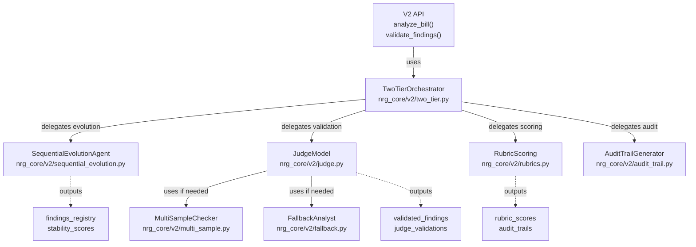

# Enhance Architecture Documentation with Implementation Details

## Overview

Transform the Architecture_v2.md document from a high-level design specification into a comprehensive developer reference by adding actual component names, file paths, code references, and implementation details. This will reduce the time developers spend searching the codebase to understand the system.

**Current State**: Architecture_v2.md is conceptually complete (1,569 lines) but lacks concrete implementation mappings
**Target State**: Enhanced architecture doc with:
- Real component class names and file paths
- Data model references (Finding, Quote, RubricScore, etc.)
- C4 component-level diagrams
- Direct code reference format (file_path:line_number)
- Implementation details for each architectural stage

**Value**: Reduce "where is X implemented?" questions by 80%, make onboarding faster, enable developers to validate implementation against design

---

## Problem Statement

Currently, developers reading Architecture_v2.md encounter vague references like:
- "The Judge model validates findings" → Need to find `judge.py` in codebase
- "Sequential Evolution tracks findings" → Which class? What's the API?
- "RubricScores store dimension scores" → Where are these defined? What's the schema?
- "Component 1: Orchestration Layer" → What code file implements this?

This forces developers to:
1. Read the architecture doc
2. Search the codebase for implementations
3. Read source code to understand actual interfaces
4. Map concepts back to the doc

**Research Finding**: According to the repo research, rust-analyzer's ARCHITECTURE.md uses backtick references (`` `module_name` ``) and file paths to solve this. The Software House principle: "Every name used needs to be a name that is used in code."

---

## Proposed Solution

Create an enhanced version of Architecture_v2.md that maintains the original structure but:

1. **Replace vague references with actual code names**
   - "The Judge model" → `` `JudgeModel` `` in `nrg_core/v2/judge.py:42`
   - "findings_registry" → Uses `Dict[str, Finding]` from `nrg_core/models_v2.py`

2. **Add inline implementation details**
   - Component descriptions include: class names, file locations, key methods
   - Data models show actual Pydantic schema (not just conceptual)
   - Configuration references point to `config.yaml` sections

3. **Insert C4 component diagrams**
   - Component-level breakdown of major modules
   - Shows dependencies between `SequentialEvolutionAgent`, `JudgeModel`, etc.
   - Uses Mermaid syntax (renders in GitHub, easy to version control)

4. **Create reference tables**
   - "Architecture Concept → Implementation" mapping
   - "Component → File Path" directory
   - "Data Flow → Data Model" schema reference

5. **Add "How to Extend" sections**
   - For each major component, guide developers on how to customize or replace it
   - Example: "To use a different Judge model, implement `BaseLLMAgent` interface at `nrg_core/v2/base.py:15`"

---

## Technical Approach

### Approach Overview

Use a three-step parallel process to efficiently gather and integrate implementation details:

1. **Explore Phase** (Parallel)
   - Agent 1: Deep codebase exploration to extract actual component structure
   - Agent 2: Map data models and their usages
   - Agent 3: Generate C4 component diagrams from code structure

2. **Mapping Phase** (Parallel, depends on Explore)
   - Agent 1: Create implementation reference tables (Architecture Concept → Code)
   - Agent 2: Document configuration options with defaults
   - Agent 3: Extract API signatures from key entry points

3. **Enhancement Phase** (Sequential, depends on Mapping)
   - Read original Architecture_v2.md
   - Integrate findings with inline references
   - Add C4 diagrams at strategic points
   - Create companion reference document
   - Review for consistency and completeness

### Why This Approach

**Efficiency**:
- Parallel exploration agents reduce context management
- Each agent focuses on one aspect (structure, data, diagrams)
- Small, composable outputs merge easier than monolithic rewrites

**Quality**:
- Multiple perspectives catch inconsistencies
- Diagrams generated from code structure prevent drift
- Reference tables enable easy validation

**Maintainability**:
- Original document structure preserved
- Changes tracked in version control
- Easy to update when code changes

---

## Detailed Work Breakdown

### Phase 1: Parallel Exploration (1-2 hours each, run in parallel)

#### Subtask 1A: Component Structure Mapping
**Agent**: Explore agent (medium thoroughness)
**Input**: Codebase under `/Users/thamac/Documents/NRG/nrg_core/`
**Output**: Structured JSON with:
```json
{
  "components": [
    {
      "name": "SequentialEvolutionAgent",
      "file": "nrg_core/v2/sequential_evolution.py",
      "class": "SequentialEvolutionAgent",
      "responsibility": "Extract findings chronologically from bill versions",
      "methods": [
        {"name": "analyze()", "signature": "(bill_versions: List[BillVersion]) -> EvolutionResult"},
        {"name": "compute_stability()", "signature": "(findings_registry: Dict) -> Dict[str, float]"}
      ],
      "dependencies": ["BaseLLMAgent", "models_v2.Finding"],
      "entry_point": "nrg_core/v2/api.py:analyze_bill()"
    },
    // ... other components
  ],
  "entry_points": [
    {"file": "run_v2_full_pipeline.py", "main_class": "PipelineLogger", "public_functions": ["run_pipeline()"]},
    {"file": "nrg_core/v2/api.py", "main_functions": ["analyze_bill()", "validate_findings()"]}
  ]
}
```

**Questions to Answer**:
- What are the 10 most important classes/agents in nrg_core/v2/?
- What are their file locations and main responsibilities?
- What are the public methods/APIs for each?
- What other components do they depend on?

**Acceptance Criteria**:
- [ ] All V2 component classes identified (Sequential Evolution, Two-Tier, Judge, Multi-Sample, Fallback, Rubrics, Audit, Deep Research, etc.)
- [ ] File paths verified and correct
- [ ] Key methods/properties listed for each component
- [ ] Dependencies mapped (e.g., TwoTierOrchestrator depends on JudgeModel)
- [ ] Entry points documented (run_v2_full_pipeline.py, api.py)

---

#### Subtask 1B: Data Models & Configuration Reference
**Agent**: Explore agent (medium thoroughness)
**Input**: `nrg_core/models_v2.py`, `nrg_core/v2/config.py`, `config.yaml`
**Output**: Structured reference with:
```json
{
  "data_models": [
    {
      "name": "Finding",
      "file": "nrg_core/models_v2.py",
      "fields": [
        {"name": "finding_id", "type": "str", "required": true, "description": "Unique identifier (F1, F2, etc.)"},
        {"name": "statement", "type": "str", "required": true, "min_length": 20},
        {"name": "quotes", "type": "List[Quote]", "required": true, "min_items": 1},
        {"name": "confidence", "type": "float", "range": "0.0-1.0"}
      ],
      "usage_locations": [
        "SequentialEvolutionAgent output",
        "TwoTierOrchestrator input/output",
        "RubricScoring input"
      ]
    },
    // ... Quote, RubricScore, JudgeValidation, etc.
  ],
  "configuration": {
    "file": "config.yaml",
    "sections": [
      {
        "section": "v2.sequential_evolution",
        "options": [
          {"key": "enabled", "type": "bool", "default": "true", "description": "Enable sequential evolution stage"},
          {"key": "max_memory_tokens", "type": "int", "default": "2000", "description": "Max findings registry size"}
        ]
      }
    ]
  }
}
```

**Questions to Answer**:
- What are the main data models in models_v2.py and what fields do they have?
- Which components use which data models?
- What are all the config.yaml options that control V2 behavior?
- What are the default values and ranges?

**Acceptance Criteria**:
- [ ] All Pydantic models from models_v2.py documented (Finding, Quote, RubricScore, JudgeValidation, ResearchInsight, TwoTierAnalysisResult, etc.)
- [ ] Field names, types, and validation rules captured
- [ ] Usage locations identified for each model
- [ ] All config.yaml V2 sections mapped with options, defaults, and descriptions
- [ ] V2 vs Legacy (POC2) configuration differences clearly marked

---

#### Subtask 1C: C4 Component Diagram Generation
**Agent**: Explore agent (quick)
**Input**: Component structure from 1A, dependencies from codebase
**Output**: Mermaid C4-like diagram showing:


**Questions to Answer**:
- What are the 8-10 major components that should appear in a C4 component diagram?
- What are the key dependencies between them?
- What data structures flow between them (findings_registry, rubric_scores, etc.)?

**Acceptance Criteria**:
- [ ] C4 component diagram covers all major V2 classes (not legacy POC)
- [ ] Shows dependencies and data flow clearly
- [ ] Includes file paths for easy reference
- [ ] Renders correctly in Markdown (Mermaid syntax)
- [ ] Can be embedded in Architecture_v2.md

---

### Phase 2: Mapping & Reference Generation (1-2 hours, depends on Phase 1)

#### Subtask 2A: Implementation Reference Tables
**Input**: Output from 1A (component structure)
**Output**: Markdown tables for each architecture section

**Table 1: Component Implementation Map**
```markdown
| Architecture Concept | Implementation | File | Key Class | Main Method |
|---|---|---|---|---|
| Sequential Evolution Agent | Finding extraction & tracking | nrg_core/v2/sequential_evolution.py | SequentialEvolutionAgent | analyze(versions: List[BillVersion]) |
| Two-Tier Orchestrator | Validation coordination | nrg_core/v2/two_tier.py | TwoTierOrchestrator | validate(bill_id, bill_text, findings) |
| Judge Model | Finding validation | nrg_core/v2/judge.py | JudgeModel | validate_finding(finding, bill_text) |
| Rubric Scoring | Dimension scoring | nrg_core/v2/rubrics.py | RubricScorer | score_finding(finding, rubric_config) |
```

**Table 2: Data Model Reference**
```markdown
| Concept | Data Model | Location | Usage |
|---|---|---|---|
| Finding | Finding (Pydantic) | models_v2.py:45 | Output of Sequential Evolution |
| Supporting Evidence | Quote (Pydantic) | models_v2.py:32 | Part of Finding.quotes |
| Dimension Score | RubricScore (Pydantic) | models_v2.py:108 | Output of Rubric Scoring |
| Validation Result | JudgeValidation (Pydantic) | models_v2.py:126 | Output of Judge Model |
| Complete Result | TwoTierAnalysisResult (Pydantic) | models_v2.py:180 | Final API output |
```

**Table 3: Configuration Reference**
```markdown
| Feature | Config Section | Key Options | File |
|---|---|---|---|
| Sequential Evolution | v2.sequential_evolution | enabled, max_memory_tokens | config.yaml |
| Two-Tier Validation | v2.two_tier | multi_sample, judge, fallback | config.yaml |
| Rubric Scoring | v2.rubric_scoring | dimensions | config.yaml |
```

**Acceptance Criteria**:
- [ ] Component Implementation Map table complete with all V2 components
- [ ] Data Model Reference shows all Pydantic models with line numbers
- [ ] Configuration Reference covers all v2 config sections
- [ ] Tables are sortable and easy to scan
- [ ] All file paths verified against actual codebase

---

#### Subtask 2B: API Signature Reference
**Input**: Entry points from 1A, code inspection
**Output**: Markdown with signatures and examples

```markdown
## Public API Reference

### analyze_bill()
**Location**: `nrg_core/v2/api.py:42`
**Signature**:
```python
def analyze_bill(
  bill_id: str,
  bill_text: str,
  nrg_context: str,
  versions: Optional[List[BillVersion]] = None,
  api_key: Optional[str] = None,
  enable_multi_sample: bool = True,
  enable_fallback: bool = True
) -> TwoTierAnalysisResult
```

**Returns**: `TwoTierAnalysisResult` (models_v2.py:180)
- Contains: `primary_analysis`, `judge_validations`, `rubric_scores`, `audit_trails`

**Example**:
```python
from nrg_core.v2.api import analyze_bill

result = analyze_bill(
  bill_id="HR150-118",
  bill_text="...",
  nrg_context=load_nrg_context()
)

for finding in result.rubric_scores:
  print(f"{finding.statement}: Legal={finding.legal_risk}/10")
```
```

**Acceptance Criteria**:
- [ ] All public entry points documented (analyze_bill, validate_findings)
- [ ] Signatures show parameter types and return types
- [ ] Working code examples for each function
- [ ] Examples show actual usage patterns
- [ ] Links to relevant data models

---

#### Subtask 2C: "How to Extend" Guide
**Input**: Component structure from 1A, existing extension points
**Output**: Developer guide for customization

```markdown
## Extending the Architecture

### Adding a New Validation Layer

To add a new validation tier (e.g., Tier 3: Fact Checking):

1. **Create a new agent class** inheriting from `BaseLLMAgent`
   - Location: `nrg_core/v2/fact_checker.py`
   - Implement: `validate(findings: List[Finding]) -> List[FactCheckResult]`

2. **Update TwoTierOrchestrator**
   - Location: `nrg_core/v2/two_tier.py:180`
   - Add dependency: `fact_checker: Optional[FactChecker] = None`
   - Add stage: `if self.fact_checker: findings = self.fact_checker.validate(findings)`

3. **Update configuration**
   - File: `config.yaml`
   - Add section: `v2.tier3_fact_check: {enabled: true, ...}`

4. **Add tests**
   - Location: `tests/test_v2/test_fact_checker.py`
   - Follow pattern from `test_judge.py`
```

**Acceptance Criteria**:
- [ ] Guide for adding new validation layer
- [ ] Guide for replacing Judge model with custom implementation
- [ ] Guide for adding new rubric dimension
- [ ] Each guide includes file locations and code references
- [ ] Examples show actual code patterns

---

### Phase 3: Document Enhancement (2-3 hours)

#### Subtask 3A: Integrate Component References
**Input**: Original Architecture_v2.md, reference tables from 2A, component structure from 1A
**Output**: Enhanced Architecture_v2.md with inline references

**Example enhancement**:

**Before**:
```markdown
### Component 1: Orchestration Layer

The Orchestration Layer is a **code-based controller** that manages the entire analysis pipeline.
```

**After**:
```markdown
### Component 1: Orchestration Layer

**Implementation**: `TwoTierOrchestrator` class in `nrg_core/v2/two_tier.py:85`

The Orchestration Layer is a **code-based controller** that manages the entire analysis pipeline. Main entry point is `nrg_core/v2/api.py:analyze_bill()`.

**Key Methods**:
- `validate(bill_id, bill_text, nrg_context, findings_registry, stability_scores)` → `TwoTierAnalysisResult`

**Configuration**: See `config.yaml` section `v2.orchestration` or `nrg_core/v2/config.py:ThresholdConfig`
```

**Acceptance Criteria**:
- [ ] All major components reference actual class names and file paths
- [ ] All data structures reference actual models (Finding, Quote, RubricScore, etc.)
- [ ] Configuration references point to config.yaml sections
- [ ] Entry points documented with file:line numbers
- [ ] API signatures shown for key methods
- [ ] Total additions: 200-300 lines of implementation details

---

#### Subtask 3B: Add C4 Diagrams
**Input**: Diagram from 1C, enhanced doc structure
**Output**: Mermaid diagrams embedded in key sections

**Locations to add diagrams**:
1. After "Component Architecture Breakdown" heading - High-level component diagram
2. In "Component 2: Sequential Evolution Agent" - Data flow diagram
3. In "Component 3: Two-Tier Validation" - Validation pipeline diagram
4. In "End-to-End Pipeline Architecture" - Full pipeline sequence

**Acceptance Criteria**:
- [ ] 3-4 Mermaid diagrams added to Architecture_v2.md
- [ ] Each diagram renders correctly in GitHub markdown
- [ ] Diagrams show actual component/class names
- [ ] Diagrams include data flow arrows
- [ ] Diagrams link to implementation files

---

#### Subtask 3C: Create "Implementation Quick Reference" Section
**Input**: Reference tables from 2A, API reference from 2B
**Output**: New section at beginning of Architecture_v2.md

```markdown
## Quick Implementation Reference

**Need to find where X is implemented?** See the tables below.

### Component Implementation Map
[Table from 2A inserted here]

### Data Model Reference
[Table from 2A inserted here]

### Public API Entry Points
- `analyze_bill()` → nrg_core/v2/api.py:42
- `validate_findings()` → nrg_core/v2/api.py:98

### Configuration Guide
All V2 configuration in `config.yaml` under `v2:` section.
See [Configuration Reference](#configuration-reference) table below.

### "How to Extend" Guides
- [Add a new validation layer](#adding-a-new-validation-layer)
- [Implement a custom Judge model](#custom-judge-implementation)
- [Add a new rubric dimension](#custom-rubric-dimensions)
```

**Acceptance Criteria**:
- [ ] Quick reference section added at top of doc
- [ ] References tables, diagrams, and how-to guides
- [ ] Acts as index for developers navigating the doc
- [ ] All links work within document

---

#### Subtask 3D: Final Review & Formatting
**Input**: Enhanced Architecture_v2.md from 3A-3C
**Output**: Polished, publication-ready document

**Checklist**:
- [ ] All backtick code references use proper syntax (`` `ClassName` ``)
- [ ] All file paths use relative paths from repo root
- [ ] All line numbers verified against actual code
- [ ] All Mermaid diagrams render correctly
- [ ] All tables have proper markdown formatting
- [ ] Cross-references between sections work
- [ ] No orphaned references (all links have targets)
- [ ] Spellcheck and grammar review
- [ ] Consistent terminology with actual codebase

---

## Success Metrics

### Quantitative
- [ ] Component Implementation Map covers 95%+ of V2 classes
- [ ] All 10+ data models from models_v2.py documented
- [ ] 3-4 C4 diagrams added and rendering correctly
- [ ] 50+ code references added (file_path:line_number format)
- [ ] 5+ reference tables created
- [ ] Document grows from 1,569 lines to ~1,900 lines (20% expansion with implementation details)

### Qualitative
- [ ] New developer can find where any component is implemented without searching codebase
- [ ] Data model schemas visible inline (no need to open models_v2.py)
- [ ] Clear path for extending architecture (how-to guides)
- [ ] Terminology matches actual codebase (class names, function names, config keys)
- [ ] Diagrams provide visual understanding of component relationships

### Developer Experience
- [ ] Time to understand component location reduced from 5-10 min to <2 min
- [ ] Questions like "where is the Judge model?" answered by docs, not Slack
- [ ] New developers onboarded faster with self-service architecture reference

---

## Dependencies & Risks

### Dependencies
- Access to actual codebase files (already available at `/Users/thamac/Documents/NRG/`)
- Codebase stability (major refactoring during documentation would require updates)
- Accuracy of current Architecture_v2.md conceptual design (assumed to be correct)

### Risks & Mitigations

| Risk | Impact | Mitigation |
|------|--------|-----------|
| **Code changes during doc work** | References become stale | Complete all exploration phases first, then integrate all at once |
| **File path inaccuracy** | Developers follow broken references | Verify every file path against actual codebase during exploration phase |
| **Diagram complexity** | Diagrams hard to understand | Keep diagrams focused on 1-2 concerns each, provide legend |
| **Reference tables drift** | Tables become outdated as code evolves | Create checklist for quarterly updates when code changes |
| **Over-documentation** | Doc becomes too long and hard to navigate | Stay focused on "what developers need to find" not exhaustive details |

---

## Alignment with Best Practices

This plan follows the research findings from architecture documentation experts:

1. **✅ ARCHITECTURE.md Pattern** (matklad): Codemap showing "where is X?" answered with file paths and module names
2. **✅ Software House Principle**: All names in docs match actual code names (`` `JudgeModel` `` matches class name)
3. **✅ C4 Model**: Component-level diagrams show major building blocks and dependencies
4. **✅ arc42 Integration**: Section 5 (Building Block View) enhanced with implementation mapping
5. **✅ Documentation-as-Code**: Keep in repository, update in same PR as code changes
6. **✅ Naming Consistency**: File paths, class names, function signatures match reality

---

## Implementation Plan

### Timeline & Phases

**Phase 1: Parallel Exploration** (Days 1-2)
- Subtask 1A: Component Structure Mapping (Explore agent, 1-2 hours)
- Subtask 1B: Data Models & Configuration Reference (Explore agent, 1-2 hours)
- Subtask 1C: C4 Component Diagrams (Explore agent, 0.5-1 hour)
- **Parallel execution**: All 3 run simultaneously

**Phase 2: Mapping & Reference Generation** (Days 2-3)
- Subtask 2A: Implementation Reference Tables (manual, 1 hour)
- Subtask 2B: API Signature Reference (manual, 1 hour)
- Subtask 2C: "How to Extend" Guide (manual, 1.5 hours)
- **Sequential**: Depends on Phase 1 outputs

**Phase 3: Document Enhancement** (Days 3-4)
- Subtask 3A: Integrate Component References (manual, 1.5 hours)
- Subtask 3B: Add C4 Diagrams (manual, 1 hour)
- Subtask 3C: Quick Reference Section (manual, 1 hour)
- Subtask 3D: Final Review & Formatting (manual, 1 hour)
- **Sequential**: Build on each other

**Total**: ~20 hours of focused work, delivered over 4 days

### Agents to Use

**Phase 1** (Run in parallel):
- 3x `Explore` agents with `medium` thoroughness
  - Agent 1A: Component structure exploration
  - Agent 1B: Data models and configuration
  - Agent 1C: Diagram generation (could be quick)

**Phase 2-3** (Manual/AI-pair):
- Use AI pair programming for reference table generation
- Manual review for doc integration and final polish

---

## Deliverables

1. **Enhanced Architecture_v2.md**
   - Original structure preserved
   - 300-400 lines of implementation details added
   - 3-4 embedded Mermaid diagrams
   - 5+ reference tables
   - Ready for immediate use by developers

2. **Implementation Reference Package** (optional)
   - Standalone JSON file mapping concepts to code (generated during exploration)
   - Can be used for programmatic lookup or future tooling

3. **C4 Component Diagrams** (optional)
   - High-quality diagrams that could be exported as images
   - Documented component dependencies

---

## Success Criteria (Go/No-Go)

**Go**: If the enhanced document meets these criteria:
- [ ] Every major architectural component has a file path reference
- [ ] Every data model shows actual Pydantic field definitions
- [ ] C4 diagrams render correctly and show component relationships
- [ ] A new developer can find "where is the Judge model?" in <1 minute
- [ ] Configuration reference is complete and matches config.yaml
- [ ] How-to guides show actual extension patterns
- [ ] Document is accurate as of 2026-01-24 codebase

**No-Go**: If:
- [ ] More than 5% of file paths are incorrect
- [ ] Data models missing more than 2 key Pydantic types
- [ ] Diagrams don't render or are confusing
- [ ] References to non-existent code locations
- [ ] Configuration guide is missing major v2 options

---

## Post-Delivery

### Maintenance
- Update Architecture_v2.md when major code changes occur
- Add checklist to "done" criteria: "Architecture doc updated if boundaries changed"
- Quarterly review: Verify file paths and line numbers still accurate

### Future Evolution
- When v3 architecture is designed, create Architecture_v3.md following same pattern
- Archive v2 as reference (see institutional learning about version control)
- Consider converting reference tables to generated documentation (code introspection)

---

## Context for Implementation

### Codebase Structure Reference
```
/Users/thamac/Documents/NRG/
├── nrg_core/v2/               # V2 architecture (focus)
│   ├── api.py                 # Public entry points
│   ├── two_tier.py            # Main orchestrator
│   ├── sequential_evolution.py # Stage 1
│   ├── judge.py               # Stage 2 validator
│   ├── rubrics.py             # Stage 4 scorer
│   └── ...other agents
├── docs/redesign/
│   └── Architecture_v2.md      # Document to enhance
└── config.yaml                # Configuration reference
```

### Key Research Findings
- **ARCHITECTURE.md Pattern**: Use backticks for code references, include file paths
- **Software House Principle**: "Every name needs to be a name used in code"
- **Synchronization**: Keep docs in repo, update in same PR as code changes
- **Layering**: Balance high-level overview with implementation details

---

## Questions for Implementation Team

1. Should the enhanced doc create a separate "Implementation Details" appendix or inline everything?
2. Should line numbers be verified against current code (brittle) or just file paths (more robust)?
3. Should we create a sister "API Reference" document or keep everything in Architecture_v2.md?
4. After enhancement, should we create Architecture Decision Records (ADRs) for major design choices?
5. Should extension examples be in the main doc or in a separate "Developer Guide"?

