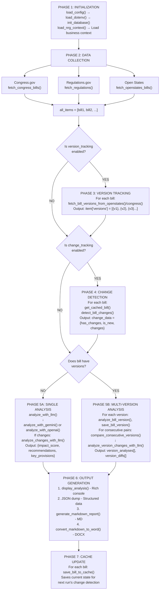

## Architecture

### Pipeline Flow



### Data Sources
- **Congress.gov**: Federal bills
- **Regulations.gov**: Federal regulations  
- **Open States**: State bills (primary)
- **LegiScan**: State bills (fallback)

### Analysis Paths
- **Path A (Multi-Version)**: Analyzes each version independently + compares consecutive versions
- **Path B (Single)**: Analyzes current bill + detects changes from last run

---

## Key Capabilities

1. **Multi-Source Aggregation**: 4 APIs with automatic failover
2. **Intelligent Analysis**: Impact scores, recommendations, affected assets
3. **Version Intelligence**: Tracks all versions, compares consecutive pairs
4. **Change Alerting**: Detects text/status/amendment changes
5. **Flexible Output**: JSON/MD/DOCX formats

---

## Limitations & Technical Debt

### Current Limitations

| Category | Issue | Impact | Fix |
|----------|-------|--------|-----|
| **Performance** | Re-analyzes all versions on every run (see TODO at line 3914) | Wastes LLM costs on unchanged versions | Implement cached analysis retrieval |
| **Scalability** | Monolithic architecture, single-threaded | Slow with 100+ bills | Async processing, parallel LLM calls |
| **Version Diff Storage** | Diffs not persisted to database | Can't retrieve historical comparisons | Add version_diffs table |
| **API Rate Limits** | No rate limiting | May hit API limits with large queries | Implement exponential backoff, request queuing |
| **Error Handling** | Fail-soft design sometimes hides errors | Silent failures possible | Structured logging, error reporting dashboard |

> **Fail-Soft** means code catches exceptions and returns default values (empty lists, zero scores) instead of alerting or propagating errors. When an API is down, system gets 0 bills but no alert; log shows error but system continues normally.

**Issue Types:**

1. **API Fetch Failures -> Empty Lists**
   - Line 318-320: `fetch_congress_bills()` returns `[]`
   - Line 568: `fetch_regulations()` returns `[]`
   - Line 698: `fetch_legiscan_bills()` returns `[]`
   - Line 1122: `fetch_openstates_bills()` returns `[]`

2. **LLM Analysis Failures -> Error Dicts with Score=0**
   - Line 1270: `analyze_with_openai()` returns `{"error": str(e), "business_impact_score": 0}`
   - Line 1454-1457: `analyze_with_gemini()` returns error dict with score=0
   - Impact: Bills appear "low-priority" when actually analysis failed

3. **PDF Extraction Failures -> None**
   - Line 3182-3220: `extract_pdf_text()` returns `None` on HTTP/parsing errors
   - Impact: Falls back to short abstract, LLM analyzes incomplete data

4. **Version Analysis Degradation -> Empty Dict**
   - Line 4014-4021: If all version analyses fail, `analysis = {}`
   - Impact: Bill added to report with blank fields, no alert

5. **Change Analysis Skipped -> Error Dict Used**
   - Line 3622-3630: `analyze_changes_with_llm()` failure returns error dict
   - Impact: Critical status changes not analyzed properly

### Technical Debt

- **PDF extraction reliability** (some PDFs might fail)
- **No retry logic** for LLM API failures  
- **Hard-coded energy keywords** (should be configurable)
- **No unit tests**

---

## Production Ready Checklist

| Component | Current State | Production Need |
|-----------|--------------|----------------|
| Architecture | Monolithic | Microservices |
| Database | SQLite | PostgreSQL |
| Authentication | None | User auth + RBAC |
| Monitoring | Console logs | Structured logging + alerts |
| Testing | Manual | Unit + integration tests |
| Deployment | Local script | CI/CD pipeline |
| Scheduling | Manual run | Cron/scheduler |
| Cost Tracking | None | LLM usage monitoring |

---

## Anticipated Questions

**Q: How accurate is the LLM?**  
A: Good qualitative results. Need formal validation with Gov Affairs on 20-30 bills. LLM provides auditable reasoning.

**Q: What if API goes down?**  
A: Fail-soft design - returns partial results. Open States has LegiScan fallback. Production will add retry logic.

**Q: Can it scale to 50 states?**  
A: Not current architecture. With microservices + async processing, yes. Open States covers all 50 states.

**Q: What's the ROI?**  
A: Cost ~$15-50/month. Saves 10+ hrs/week = $52K/year. Payback < 1 month.

---

## Sample Output

```
Summary Statistics:
  High Impact (7-10):   0
  Medium Impact (4-6):  1
  Low Impact (0-3):     4

Change Tracking:
  New Bills:        0
  Modified Bills:   0
  Unchanged Bills:  5
```

Output Directory:
```
nrg_analysis_20260108_132515/
├── nrg_analysis_20260108_132515.json
├── nrg_analysis_20260108_132515.md
└── nrg_analysis_20260108_132515.docx
```
